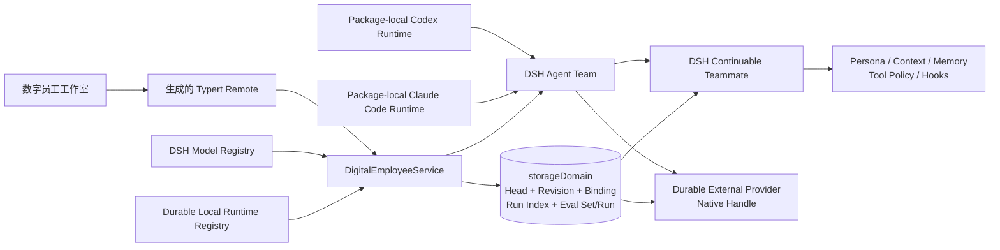

# DSH Agent Team Ultra

Agent Team Ultra 是一个依赖 DeepSeek Harness（DSH）的本地插件工作区。它在 DSH Web 的会话头部加入“数字员工工作室”，把可视化配置的 Agent Profile 创建为真实、可持续恢复的 Agent Team 队友。

本项目由 `benz-ai-x` 维护，五个自有包使用 `@benz-ai-x` 命名空间：

- `@benz-ai-x/dsh-agent-team-ultra`：Host 服务与 Remote 合约。
- `@benz-ai-x/dsh-client-ui-agent-team-ultra`：浏览器工作室。
- `@benz-ai-x/dsh-agent-team-ultra-profile`：本地安装组合包。
- `@benz-ai-x/dsh-agent-team-codex`：耐久 Codex 产品适配器。
- `@benz-ai-x/dsh-agent-team-claude-code`：耐久 Claude Code 产品适配器。

锁定 Harness 提供的依赖保留 `@deepseek-ai` 包名。命名与升级边界见 [ADR-0014](docs/adr/0014-own-ultra-packages-under-benz-ai-x.md)。

当前实现绑定 DSH `0.1.3-alpha.1` 的已验证 Phase C 维护源码，支持资格为 `agent-team-ultra.phase-c.v1`，精确提交以 [reference lock](dsh-reference.lock.json) 为准。该 source-linked fork 为 Agent Team 增加精确 teammate route、耐久外部 teammate runtime、稳定 native turn 关联、规范 evidence/usage、隔离 candidate evaluation、正交的完整协作／workspace 写入能力、精确成员操作证明、固定包内 Codex/Claude Code Runtime Backend、初始工作持久接受后的取消权转移、可撤销的 native 成员操作授权、受控的持久工作恢复读取、Lead-only 持久消息分页、公开面板 Slot 与指定成员的公开面板导航、按 Team／发送者隔离且可关联同 Team 原消息的幂等人类提交、从同一 Host 任务视图投影的列表／依赖图／详情和单 revision 依赖编辑，以及 baseline-first、共享常数空间刷新周期的有界 Team 变化订阅；任务 blocker 文案只呈现未完成前置项，fit-to-view 完整容纳普通多行图，冲突重载成功后仅为下一次显式保存推进编辑基准，已删除的依赖草稿仍可核对和取消。过滤后的键盘导航会选择可见前置，任务面板和消息中心共用公开 watch owner 以等待卸载完成。由于相关包仍为 private，本项目明确采用 local-only 交付，不声称可以从 npm 独立安装。

## 下一版本规格

[Spec #18：Agent Team Ultra vNext（规范版本 1.1）](https://github.com/benz-ai-x/dsh-agent-team-ultra/issues/18) 以“官方基础＋明确的 Ultra 扩展”为目标，中文为规范主版，附完整英文对照。native 协作、团队消息中心、任务 DAG、扩展格式迁移和升级的实现及自动化证明见各 Issue 和 [PR #63 联合验收](docs/evidence/pr63-studio-acceptance.md)；#44 的真实认证 native 验收仍待后续独立 PR，父 Spec 保持开放，受控外部边界不代表产品认证通过。

当前实现与官方基线的差异及复现证据见 [兼容性核验报告](docs/research/2026-09-05-official-agent-team-compatibility.md)。

## 能力

- 身份：Profile ID、队友名称、显示名称、职责描述。
- 运行时：从 Host 实时目录选择并固定精确的 DSH 模型或耐久本地 Agent；目录只公开可执行的上下文、Profile 与运行能力，provider 凭据和原生对象留在 Host。
- Codex：使用固定 `@openai/codex` `0.149.1` 包内原生载荷维护非临时 app-server thread；默认只读沙箱、拒绝审批且禁用网络，不搜索或回退到 `PATH` 中的 Codex。
- Claude Code：使用固定 Claude Agent SDK `0.3.241` 与 Claude Code `2.1.241` 包内原生载荷维护稳定 Session；六个受控 SDK MCP 工具在当前成员授权下读取 Team、发送消息、修改共享任务和等待变化，冷恢复用 Host 持久事实校验原生 transcript，固定只读文件工具与沙箱，不搜索或回退到 `PATH` 中的 Claude。
- 消息中心：从现有 Agent Teams 面板按成员、方向和投递阶段分页浏览持久消息；正文仅在选择后读取，私有 block 明确省略，投递不表示已读或任务完成。公开 Team watch 每个连接世代先给完整 Host baseline，后续仅用有界 invalidation 触发同一筛选的权威重读；page／roster 各自同时最多一次读取，任务视图的任意 burst 共用一个 completion 与 dirty bit，直到最后一次失效后的权威读取发布，replacement 期间旧 cursor 不能开始 append。断线保留明确 stale 页面，重连从不自动重发消息意图。
- 人格与任务：独立的 persona、长期 mission 和每次创建时的 assignment。
- 工具栈：继承全部、仅允许所选、或禁用所选；Agent Team 自有协作工具由 Team 子作用域保留。
- 实际协作能力：Studio 按精确 DSH 成员当前可见的 Team 工具显示，工具卸载／恢复会刷新快照；原生启动／恢复若明确要求完整协作，必须返回该 handle 的全部六项成员操作证明，否则拒绝并清理资源。不要求完整协作的成员仍可显示有限或未确认。
- 上下文与记忆：有序、可启停的上下文块和策展式长期记忆块。
- Hook：安全的声明式 `session-start`、`before-step`、`before-tool`、`after-tool` 行为，不执行任意 JavaScript 或 shell。
- 生命周期：不可变 Profile Revision、内容指纹、Head CAS、显式激活/回滚、归档/恢复、不可变启动快照和完整 Fiber 清理。
- 启动可靠性：Client 为一次启动意图生成 UUID，Host 按 Team 幂等处理并从权威 roster 恢复中断的 Binding；外部 provider 在 active 前返回稳定 native handle，重启与 provider 回归只恢复该 handle，不重复创建员工。
- 对话协作：每个实时 Team Lead 都能用固定的 `ultra_profile_list`、`ultra_profile_detail` 和 `ultra_profile_launch` 查看既有 Profile 并启动 Active Revision；一次持久模型工具调用稳定映射为同一个 Launch Request ID，普通 `spawn_teammate` 仍创建不绑定 Profile 的成员。
- Run 证据：每个已接受工作轮次确定性映射为一个有界、可重建 Run；列表仅保存身份、路由、终态、provider 报告的用量和完整性，详情按需从 DSH Session 或外部原生 turn 脱敏折叠。
- 候选评测：每个 Profile 可拥有独立版本化 Eval Set；每个 Case 在全新、只读、无审批的非 roster 运行时执行，精确记录 Profile/Eval Set/运行时世代/环境指纹，取消、崩溃和缺失证据绝不推断为通过。
- 发布门禁：Profile Head 可要求一个精确 Eval Set Revision；只有仍匹配当前候选、能力世代、断言 schema 和隔离环境的 passed Eval Run 才允许激活，评测本身不会自动发布。
- 工作台：Profiles、Runtime Backends、Revisions、Instances、Runs、Evaluations 六个入口，以及 Eval Set 编辑、评测证据和有界版本差异；窗口支持拖动、八方向缩放，并随可用视口自动收敛布局。
- 实时投影：每个连接世代先接收完整 Host baseline，再按合并后的 domain/runtime/roster/turn/eval 失效信号整体替换；断线保留最后完整快照并标为 stale，终止连接单独显示 disconnected，迟到的一次性读取不能覆盖新世代。



浏览器只维护编辑草稿。Host 负责校验、权限判断、版本冲突和持久化；Agent Team 继续负责 roster、mailbox、task、Session 恢复与子 Agent 销毁。Profile 通过同步 `agent/created` 生命周期安装到精确的 `agent.ctx`，在 `agent/session-start` 和首次提示词组装前生效。

## 开发与验证

前置条件：准备一份已构建且与 `dsh-reference.lock.json` 完全一致的 Harness checkout。首次准备默认选择相邻 `../deepseek-harness`；也可以指定任意隔离目录：

```sh
DSH_HARNESS_ROOT=/absolute/path/to/locked-harness pnpm prepare:harness
pnpm install
pnpm verify
```

`prepare:harness` 先核验 commit、文档摘要和源码状态，再建立仓库内忽略跟踪的 `.dsh/harness` 链接，并输出实际源码路径及来源证明。后续命令沿用这份选择；相对 `DSH_HARNESS_ROOT` 始终从 Ultra 仓库根目录解析，与执行目录无关。切换选择时重新执行准备和依赖安装，准备过程只调整本仓库链接，不切换 Harness checkout，也不访问应用的 `DSH_HOME`。

依赖链接、TypeScript、Vitest 的源码别名、Typert 生成和打包均使用这份选择。检查器同时核对声明路径与 `node_modules` 实际解析；混入其他来源会报告实际路径并拒绝继续。需要并行验证其他源码时，先建立独立 Ultra checkout，再在其中执行相同准备步骤。

`pnpm verify` 会依次完成：严格校验 Harness commit、文档摘要、源码来源和链接产物新鲜度；Host/Client 构建；官方 Typert 代码生成；完整的单元、Cordis、Loader、Client 与生命周期测试；实际 package closure 的本地归档干净安装及两类原生运行时解析；真实 DSH Web profile 的组合/启动；最后卸载并检查 Loader 与包残留。

## 安装到本地 DSH Web

先构建全部产物并生成审计归档：

```sh
pnpm run pack:local
```

该命令会先执行严格上下文校验和构建，然后从 Profile 的实际包入口及其本地 overlay 依赖闭包推导归档集合，在 `artifacts/agent-team-ultra/` 输出归档。`/data` 等子入口属于同一个包，不另算归档；当前结果是五个 Ultra 包与三个锁定 Harness private Agent Team 包，数量不是脚本常量。其余构建证明中的 Harness 依赖全部来自锁定 checkout 的 `link:`。使用本次打印的完整 `file:`／`link:` 参数，勿用目录通配符混入历史旧包；核心形式如下：

```text
node scripts/compatible-dsh.mjs --lock-local-peers plugin --profile web add <本次全部 file: 归档参数> <锁定 Harness 的 link: peer 参数>
```

全新空白数据安装随后检查最终配置并启动 Web。**B 或更旧版本的已有数据升级**，必须先完成下方[隔离联合迁移](#隔离联合迁移batch-4)，把公开 data 行的 Session 与存储路径都指向同一个 complete 目标，之后才能首次启动新版业务 Host；不要先用新版打开原业务根。

```sh
pnpm compatibility:check
pnpm dsh:checked --profile web --dump-config
DSH_HOME=/absolute/path/to/isolated-dsh-home pnpm dsh:checked web --no-open --port 4317
```

安装与启动必须使用同一个 `DSH_HOME`；上例路径需要替换为安装时所用路径，端口需选择未占用值。打印的安装命令使用本仓库绝对路径的预检入口，仍调用所选锁定 CLI。安装前核对源码、文档和构建产物，安装完成后及每次启动前检查真实依赖；错误提交、缺包、同版本错误产物或不合格 SDK 返回 `ULTRA_COMPAT_*` 诊断，拒绝加载业务服务。

`--lock-local-peers` 是显式安装选项：只接受构建证明内、来自当前选定 Harness 的链接，并把这些链接合入该 profile 的 `pnpm-workspace.yaml` overrides，约束嵌套依赖与顶层依赖，同时写入本仓库声明的 `packageManager`（pnpm 11.7.0）。其他设置保留；已有不同的 package manager 或同名不同值的 override 会拒绝安装，须停机核对后人工协调，不静默覆盖。此配置随该本地 Harness 安装保留，不把 overlay 归档改成源码链接；否则 Team 内部的版本范围可能另装较新的 registry 包，触发正确的兼容拒绝。

该选项也从构建证明推导已核验 SDK 的直接链接及 override，复用本次依赖安装内的 Codex／Claude SDK 与平台载荷；不更换 SDK 版本、不读取或复制认证、配置和 native 历史。链接依赖该工作树的已安装 SDK，与 Harness peer 链接一样属于本地安装环境；勿在卸载／重新绑定前移除其源目录。迁移测试中的旧 SDK 链接由隔离测试 profile 显式解除后重绑，不允许运维入口静默覆盖用户冲突配置。

配置结果中应在 `agent-team-ultra-compatibility` 组内出现 `agent-team`、`agent-team-codex`、`agent-team-claude-code`、`tool-agent-team`、`agent-team-ultra`、`ui-agent-team` 和 `ui-agent-team-ultra` 七个稳定行。完整 `pnpm build` 在 Host、Typert、Profile 和 Client 产物生成后生成兼容性证明；单独的 `build:host`／`build:client` 是中间构建。组入口在导入时检查私有依赖，并在首次加载和配置更新时检查实际 Loader 源目录，成功后才加载子插件。检查包含 Ultra Host、UI、Profile 及各包实际解析的依赖，不使用 `NODE_PATH`。直接导入 Host 包也会先检查；Client 入口保持浏览器安全。两个冲突的全局 continuable 控制行禁用，普通 `subagent` 与 `subagent_fork` 保持 one-shot。

官方基础、维护 fork、文档摘要、扩展接口资格、Session/Team/投影/Ultra 格式和 native SDK/payload 版本分别记录在锁文件中。相同包版本不代表兼容，固定官方 `d347e7` 的未修改源码仅用于对照，不是受支持的直接替换；详见 [兼容性 ADR](docs/adr/0015-maintain-explicit-harness-compatibility.md) 和 [补丁清单](docs/reference/harness-patch-ledger.md)。固定官方源码构建完成后，可以运行 `pnpm compatibility:compare /absolute/path/to/official-d347e7`，重复官方/fork 的 queued 落盘屏障、消息顺序与发送方、冷重启恢复、wait 不唤醒冷成员、中断后任务所有权保留，以及拒绝导入验证。

`pack:local` 同时打印卸载命令。执行后，最终配置和 profile `node_modules` 中不得残留 Ultra、Codex 或 Claude Code overlay 行/包。

下列旧命名空间说明只替换包身份，不是绕过数据迁移的直接启动步骤。先停止源数据的所有 Web／Host／其他写入者并保留备份，使用旧版打印的卸载命令移除旧包，再执行新版打印的安装命令，但此时不要启动新版业务 Host。B 或更旧数据须按下方隔离迁移流程发布完整目标，将 `agent-team-ultra-data` 的 Session 与 JSON／SQLite 两处路径指向该目标后再启动，并刷新浏览器以同步 Host、Client 和生成的 RPC 标识。原源数据保留不写；可以沿用原 `DSH_HOME`、Profile 配置和 SDK 自有历史，但不能继续把原 Session／Ultra 业务根作为新版写入位置。

如果 Host／Client／Profile 已经使用 `@benz-ai-x`，Codex 或 Claude Code 仍是旧包，则停止 Web 后，沿用同一 `DSH_HOME` 只执行对应已安装旧包的移除命令，再执行本次 `pack:local` 打印的完整安装命令：

```sh
node .dsh/harness/apps/cli/lib/bin.js plugin --profile web remove --config.offline=true --config.auto-install-peers=false @deepseek-ai/dsh-experimental-agent-team-codex
node .dsh/harness/apps/cli/lib/bin.js plugin --profile web remove --config.offline=true --config.auto-install-peers=false @deepseek-ai/dsh-experimental-agent-team-claude-code
```

保留 Profile 配置、原 Session／Ultra 数据和 native 历史；此混合包名情况同样必须完成隔离迁移并配置目标后才能启动新版。`agent-team-codex`／`agent-team-claude-code` 行、`digitalEmployees` 服务、`external-agent/codex`／`external-agent/claude-code` 路由、Profile Revision、成员和 native handle 均沿用原身份。预检只接受 ESM 实际可解析的依赖；`NODE_PATH` 中的工作区副本不能补齐缺包。任一旧产品适配包仍在安装路径中时，Profile 会在子插件加载前返回 `ULTRA_COMPAT_LEGACY_RUNTIME`；先完成上述移除与安装流程，再完成数据切换。

升级验证使用独立干净的前身 checkout，已按该版本说明准备 Harness、安装依赖并完成构建：

- Codex：`pnpm verify:codex-upgrade /absolute/path/to/built-previous-checkout`，前身固定为 `debde06ce5c75658f9ad741cbfc8d535df118455`。
- Claude Code：`pnpm verify:claude-upgrade /absolute/path/to/built-previous-checkout`，前身固定为 `081357d17f7a0535b75bb7d3133177febddee4a2`。
- B 发布线双 native：`pnpm verify:b-upgrade /absolute/path/to/built-b-checkout`，B 候选固定为 PR #62 的 `4cecfe2808182c64124abd6634597bd8c46ec5f8`。

这些入口按各版本 Profile 声明的完整包身份集合核对归档，不固定包数量。验证在隔离 `DSH_HOME` 中安装旧归档并生成真实 JSON／SQLite 业务数据，再调用迁移运维入口发布到另一完整目标；新归档经真实 `/data` Loader、生成 Remote 恢复原身份、续发消息，检查目录移除／回归、源字节不变、配置到迁移目标的 Web 正常退出及完整卸载。SDK 外部历史与业务迁移目标分开，不伪装成迁移器复制出的 native 历史。Codex app-server 通道和 Claude SDK API 使用确定性外部边界替身；发货 adapter、受控进程桥接、SDK/payload 资格检查与权限策略均使用实际归档代码。真实认证后的产品验收仍由 [#44](https://github.com/benz-ai-x/dsh-agent-team-ultra/issues/44) 完成。传入 `--keep-failed` 可保留失败测试的隔离目录供诊断，成功运行自动清理其临时数据。

同一组归档入口还用真实认证 Host／生成 Client Remote、安装包的 Studio／Team Client
bundle 和 production renderer 验证历史 Run、v2 用量、完整性、失效 Lead 错误冒泡及
卸载。界面外壳为 JSDOM，不是人工浏览器或截图验收；业务组件和 Host 不替换，
真实 CLI Web 启动另行核验。共享场景与限制见 [PR #63 联合验收](docs/evidence/pr63-studio-acceptance.md)。

## 只读升级审计

在已准备锁定 Harness 并执行 `pnpm build` 的本仓库中，对停止写入的 Session 与存储快照运行：

```sh
pnpm migration:audit --sessions /absolute/path/to/sessions --json /absolute/path/to/storage
pnpm migration:audit --sessions /absolute/path/to/sessions --sqlite /absolute/path/to/storage.sqlite
```

按实际后端选择其中一条。需要纯 JSON 输出时，使用 `node scripts/audit-migration.mjs` 加相同参数。成功退出 `0`，拒绝退出 `1` 并返回稳定的 `AUDIT_*` 原因。根目录和文件必须存在、没有符号链接；每个源文件上限 64 MiB，每个目录树上限 10,000 个文件。审计前后核对文件摘要，变化中的源须重新取得静止快照；报告只包含身份、版本、检查结果和计划，不含消息正文或 native transcript。

审计区分 Session codec、Team payload、projection stateVersion、descriptor 和 Ultra Generation，核验 Profile／Revision／Binding 与 Team、固定 route、native 身份及能力需求。未知或未来业务格式拒绝读取；每个 Team 历史（含继承前缀）都经完整 payload 与状态转换检查，非继承事件必须属于当前 Session。不可用 checkpoint（含缺失或不可读的 SQLite 缓存表）基于真实日志冷重建并报告原因，源缓存保持不变；权威业务数据错误仍拒绝。v0 和 pending v1 只在内存中按现有 Host 规则投影、校验和判断重试冲突，不创建或补写目标库。历史 Session 按最高规范代际经过真实 codec／相邻链，再仅在临时副本上打开真实 read handle，防止只读 body open 向源发布新代际；报告包含实际源 Session 版本。SQLite 的数据库及 WAL 同样复制到临时目录后用只读连接检查，源 SHM 和数据库不会被 SQLite 打开或更新；所有临时副本在退出前清除。

报告区分实际观察到的 `sourceFormats` 和本次 reader 的资格／格式；源数据没有记录 writer commit 时明确返回未知，不把 reader SHA 当成源 writer。审计本身不迁移数据。Phase C 支持源码为固定官方 `d347e703` 与完整 B 组合的维护提交 `3c38b1d4e8`，资格 `agent-team-ultra.phase-c.v1`；Session 2、Team payload 2、native operation 4（保留 3 读取）、message request 1、Team projection 7 分别记录。审计的 `targetCompatibility.qualified` 只报告锁定目标源码的支持资格，不表示这个数据集已迁移；`targetWrites` 始终是 `closed-until-complete`。源保护见 [ADR 0016](docs/adr/0016-audit-and-plan-format-aware-migration.md)，实际版本见 [ADR 0026](docs/adr/0026-preserve-team-identities-on-session-v2.md)，支持资格与共享门禁见 [PR #63 联合验收](docs/evidence/pr63-studio-acceptance.md)。

## 隔离联合迁移（Batch 4）

先停止源 Session、JSON／SQLite 的**所有写入者**并保留备份。在本版本已准备、已构建的仓库中，选择实际后端；目标必须是独立的新目录，不能与任一源重合或互相包含：

```sh
pnpm migration:execute --sessions /absolute/source/sessions --json /absolute/source/storages --target /absolute/isolated-target
pnpm migration:execute --sessions /absolute/source/sessions --sqlite /absolute/source/storage.sqlite --target /absolute/isolated-target
```

命令先审计源，只在私有副本执行真实 codec、Ultra v0→v1 和 checkpoint／Run Index 重建，随后发布目标；不原地升级源。`ultra-migration-manifest.json` 先为 `pending`，业务写入保持关闭；目标文件与源身份校验通过后，最后原子发布 `complete`。没有业务不兼容字段变化，因此不新增 Ultra 代际。原生 Run 只从持久关联重建，缺少 SDK 终态时保持 `unknown`／`incomplete`，不伪造成功；既有 Eval Run 保留，Host 重启重新判定 Promotion Gate。

进程中断后用**相同源、相同版本／资格和相同目标**重试。相同文件复用，不覆盖分歧或未知文件；只回收可证明为预期内容前缀的运维临时文件。`--max-writes N` 可在第 N 次耐久发布后暂停，0 表示领取目标锁后、首次发布前暂停，均返回 `MIGRATION_PAUSED`（退出 1）；它不是业务启动开关。只留下迁移锁、尚未发布 manifest 的目标也拒绝业务准入。已完成且未投入业务的相同目标再次执行会校验并返回 `reused: true`，不重写。业务写入后不要把它当同步命令重复运行。成功退出 0，失败退出 1，输出有界的 `MIGRATION_*`／`AUDIT_*`；纯 JSON 可用 `node scripts/migrate-data.mjs` 加同样参数。报告不含 prompt、消息正文、凭据或 native transcript。

早期 `phase-c.integration-candidate.v1` 生成的目标不能直接作为本支持资格的目标复用，不能手改 manifest。先停写、备份并审计**最新保留的业务数据集**，使用本版本迁移到另一个全新目标，保留原 native 历史；若候选目标已续写业务，不能退回更早源快照而丢弃这些新增事实。目标的精确资格和完整性准入规则不放宽。

目标是数据集，**不是完整 DSH_HOME**：Session 位于 `target/sessions`；JSON 位于 `target/storage`（注意不是默认的 `storages`），SQLite 位于 `target/storage.sqlite`。完成后在已安装 Ultra 的 Profile overlay 后追加对公开数据行的配置，JSON 例如：

```yaml
- id: agent-team-ultra-data
  config:
    sessions:
      root: /absolute/isolated-target/sessions
    storage:
      backend: json
      root: /absolute/isolated-target/storage
```

SQLite 将 `storage` 改为 `{ backend: sqlite, path: /absolute/isolated-target/storage.sqlite }`。两处路径必须来自**同一次完成的迁移**；该 Loader 行在任何可写持久化注册前联合检查它们，并随同一 Fiber 释放。不要重新启用被 overlay 关闭的 `session-persistence-jsonl`、`storage-json`、`storage-domain` 基础行。新安装的默认路径仍为 `DSH_HOME/sessions` 和 `DSH_HOME/storages`。

命令不复制 Profile 配置、原生认证或 SDK 自有历史目录；只保留 DSH／Ultra 事实中的原 member／handle／turn 等身份，后续原生恢复仍需原有 SDK 数据与有效认证。旧程序／stock 回放、降级写入、源目标双向写入均不受支持；新 Loader 的 pending 保护不能约束旧二进制。当前耐久发布与进程锁验证环境为 Linux arm64，其他平台尚未资格验证。详见 [ADR 0027](docs/adr/0027-publish-one-isolated-migration-dataset.md) 与 [#41 定向证据](docs/evidence/issue-41-acceptance.md)；完整历史归档／中断矩阵归 #43，真实认证归 #44。

## 使用

在 DSH Web 中打开 Lead 会话，点击会话头部的“数字员工”：

1. 新建 Profile，填写身份、persona 和 mission。
2. 在分组目录中选择一个可用 Runtime Backend；DSH 模型会固定 provider/model/推理强度，本地 Agent 会固定耐久 provider id。
3. 选择 `fresh` 或 `fork` 及匹配的延续 Provider，再配置可继承工具、上下文、记忆和 Hook。
4. 保存候选 Revision；Runtime Target 和规范化 Required Capabilities 会参与指纹、历史和差异，过期编辑不会覆盖新版本。
5. 如需发布门禁，在“评测”页新建或编辑 Eval Set（Cases JSON、工具白名单、资源上限、通过策略），保存其独立不可变版本，并将最新版本设为当前 Profile 的激活要求。
6. 对精确候选发起 Eval Run；可取消运行、检查逐 Case 断言与规范证据，并和其他 Eval Run 对比。只有当前门禁显示“已通过”时，受门禁的候选才能激活。
7. 在“版本”页检查指纹及相对已激活版本的结构化差异，再显式激活最新候选（也可回滚到更早的不可变版本）。
8. 可选填写本次任务，点击“创建数字员工”；只有未归档 Profile 的 `activeRevision` 可以启动。
9. 左侧实例列表分别显示持久的创建阶段、当前运行时可用性和进程驻留状态，以及该员工绑定的 Profile revision、所选运行目标与实际解析目标；外部员工还保留不透明 native handle。
10. 在 Run 列表按证据来源或终态筛选；打开详情时才读取有界规范时间线，并明确显示脱敏项、截断和证据不完整/不可用状态。

当用户在对话中明确要求 Team 协作时，Lead 可先调用 `ultra_profile_list`／`ultra_profile_detail` 检查现有 Profile、Active Revision、发布门禁、能力和路由，再调用 `ultra_profile_launch`。启动工具只接受既有 Profile ID 和可选任务，不会创建、保存或激活 Profile；相同的持久 `tool/call` 在回调重试、丢失响应或 Host 冷恢复后复用同一 Launch Intent。普通队友和隔离 Evaluation Worker 不取得这三个工具。

修改 Profile 或改变 Lead/部署默认路由只影响后续创建。已经创建或冷恢复的员工始终使用其绑定的不可变快照与 continuation descriptor 固定路由。编辑时可以原样保留最新但暂时离线的历史目标；新选离线目标、激活和启动仍会稳定失败且绝不回退。

## 配置

| 字段 | 默认值 | 含义 |
|---|---:|---|
| `defaultContinuationProvider` | `spawn` | Profile 延续 Provider 留空时使用的默认值；旧 `defaultProvider` 仅作迁移别名 |
| `maxProfiles` | `64` | 持久 Profile 数量上限 |
| `maxProfileBytes` | `131072` | 单个规范化 Profile 的 UTF-8 字节上限 |
| `maxHooks` | `32` | 单个 Profile 的 Hook 数量上限 |
| `maxAssignmentBytes` | `32768` | 单次创建任务说明的 UTF-8 字节上限 |
| `maxRevisionHistory` | `32` | Studio 每个 Profile 返回的版本摘要上限 |
| `maxDiffEntries` | `512` | 单次版本结构化差异返回项上限 |
| `maxRuns` | `512` | 持久 Run 索引保留的最新记录上限 |
| `maxRunEvidenceItems` | `512` | 单次 Run 详情最多折叠的规范 evidence 条目数 |
| `maxEvalSets` | `64` | 持久 Eval Set Head 数量上限 |
| `maxEvalSetBytes` | `262144` | 单个规范化 Eval Set Revision 的 UTF-8 字节上限 |
| `maxEvalCases` | `64` | 单个 Eval Set 的 Case 数量上限 |
| `maxEvalRuns` | `256` | 持久终态 Eval Run 的最新记录上限；运行中记录不会因保留策略被删除 |

部署值位于 [cordis.patch.yml](packages/profile/cordis.patch.yml)。DSH patch 会替换目标行的完整配置；覆盖时应重述需要保留的全部字段。

## 记忆、Token 与缓存

Profile memory 是人工策展的提示词内容，不是自动学习数据库。DSH 模型员工由其持久 child Session 提供情节式对话记忆；外部员工的原生 session 与历史由对应 provider 管理，Ultra 只持久化精确 handle 和关联。冷恢复时插件会把已绑定快照交给所选运行时，并要求外部 provider 恢复同一 handle。

DSH 分支不在 child Agent 之外额外调用模型；启用的 persona、mission、context、memory 和运行时 Hook 会增加模型输入 Token，`fork` 还会继承 Lead 已完成轮次。外部分支如何把 Profile、初始工作和 mailbox turn 映射为模型调用、Token 与 KV cache，由 provider 定义。稳定 Profile 前缀可能有利于缓存，但具体命中同样由实际适配器和 provider 决定。

## 安全与边界

- Remote 请求携带 Session ID，Host 必须将它解析为当前 live Agent，再从 Agent Team 推导 membership；浏览器不能声明 Team、角色或 member 身份。
- 只有当前 Team 的 Lead 可以创建数字员工。
- Profile Head、不可变 Revision 和绑定写入独立的 `agent_team_ultra_v1` 分记录存储；旧 `agent_team_ultra` v0 仅作为只读迁移源，完成后不再打开。
- Profile 无硬删除；归档保留完整历史与绑定但阻止激活和启动，恢复必须经过 Head CAS。
- v1 迁移以显式格式标记为准，支持 JSON/SQLite 上的幂等崩溃恢复；未知、更高版本或分歧数据会拒绝启动，完成迁移后不支持回退到写 v0 的旧二进制。
- 绑定先记录 Team-scoped Launch Request ID、请求指纹、assignment 哈希、能力世代和完整 Revision/路由快照，并持久为 `pending`，再调用 Agent Team provisioning。
- 重启和实时 Team 事件会以权威 roster 修复矛盾 Binding；相同启动意图返回现有 Binding，改变输入则稳定拒绝。
- 工具名称在创建时相对当前 Lead 的工具目录再次校验；`before-tool` Hook 可按 Profile 顺序声明拒绝或精确调用审批。
- Runtime Catalog 只包含白名单化的展示、可用性、上下文、能力和推理元数据；API key、endpoint、环境值、本机路径、登录状态及 live adapter 均不会传给 Client。
- 耐久外部 provider 与 Agent Team 共用一个 Fiber 生命周期：移除时立即停止新调用，在 cleanup 宽限期后发出中止信号但继续等待实际静止，并只释放该 generation 的 runtime/evaluation handle；其他 provider 不受影响。
- Codex adapter 只在固定包内原生载荷及其版本通过资格校验时注册；它保留稳定 thread identity，幂等处理启动与 mailbox turn，并在 interrupt、崩溃修复或 Fiber disposal 时只清理精确 handle。
- Claude Code adapter 只在固定 SDK/native 载荷通过资格校验时注册；它以确定性 Session id 幂等启动，逐条串行处理 mailbox turn，冷恢复先以当前 grant 读取原 launch／delivery／settlement 并核验 transcript 身份，Host 已提交终态优先，缺少终态明确结算为 interrupted；interrupt 或 Fiber disposal 只终止精确 Query/process tree。
- 外部 mailbox、interrupt 与 evidence 始终使用精确 provider/native handle；隔离 evaluation 使用自己的 evaluation id/handle。评测运行时不进入 Team roster 或生产 workspace，结果持久化后才释放精确 handle；两类操作都不会回退到一次性 Codex/Claude subagent。
- Run Index 不复制 prompt、reply、tool argument/result、文件、环境值、credential 或原始 provider payload；详情只从规范来源按需折叠，缺失、截断和未知终态必须显式可见。
- Profile 不包含凭据字段，也不会把 API key 或其他 secret 传给 Client。

## 代码结构

- `packages/domain`：Host 服务、存储 schema、生成的 Remote 合约和 child-scope 安装。
- `packages/ui`：浏览器 Remote 挂载、React 工作台、CSS Modules 与中英文文案。
- `packages/profile`：可安装的本地 bundle patch 和冲突消解。
- `scripts/generate-typert.mjs`：在隔离分析工作区调用官方 DSH Typert generator，不修改 Harness checkout。
- `scripts/verify-pack.mjs`：归档白名单、干净安装、普通解析和真实 DSH profile 组合门禁。

接手开发请先阅读 [交接文档](HANDOFF.md)。更严格的运行时与交付约束见 [项目合约](docs/agent/PROJECT_CONTRACT.md)、[本地 overlay 决策](docs/decisions/0001-local-overlay-and-sidecar-state.md)、[v1 存储代际决策](docs/adr/0002-isolate-the-v1-storage-generation.md)、[Profile 发布生命周期决策](docs/adr/0003-separate-profile-authoring-from-release.md)、[能力感知 Runtime Target 决策](docs/adr/0004-pin-capability-aware-runtime-targets.md)、[启动意图持久化决策](docs/adr/0005-make-launch-intent-durable.md)、[耐久外部 teammate seam 决策](docs/adr/0006-use-durable-external-teammate-runtime.md)、[包内 Codex Runtime 决策](docs/adr/0007-activate-package-local-codex-runtime.md)、[包内 Claude Code Runtime 决策](docs/adr/0008-activate-package-local-claude-code-runtime.md)、[可信 Run 证据决策](docs/adr/0009-index-runs-and-fold-canonical-evidence-lazily.md)、[库存审批决策](docs/adr/0010-reuse-stock-exact-call-approval.md)、[精确隔离评测门禁决策](docs/adr/0011-gate-promotion-with-exact-isolated-evaluations.md)、[完整 Studio 快照流决策](docs/adr/0012-stream-complete-studio-snapshots.md)、[Claude Team 工具与恢复决策](docs/adr/0020-authorize-claude-team-tools.md)、[Claude 共享任务决策](docs/adr/0021-complete-claude-task-operations.md) 和 [Lead 对话启动决策](docs/adr/0022-launch-active-profiles-from-lead-conversations.md)。

## 当前限制

- 仅支持同一进程内的现有 Agent Team，不支持嵌套 Team 或跨进程 Team 消息。
- 不热更新已存在员工的 Profile，不自动写回策展记忆。
- Hook 不执行用户代码；仅提供上下文注入、工具拒绝和复用 DSH 库存审批的一次性精确调用授权。
- 固定包内 Codex `0.149.1` 或 Claude Agent SDK `0.3.241`/Claude Code `2.1.241` 未通过资格校验时，对应路由会显示为不可用。Claude Code 仅接受 fresh 上下文、继承工具策略且不支持 Hook、exact-call approval 或 evaluation；历史中暂时缺失的目标可原样保留但显示为不可用，激活或启动不会回退到 Lead 路由。
- Claude Code 的当前 query 只使用创建时安装的受控工具；更新后的后续工作 query 在同一 Session／handle 上取得六项成员操作，不改写已运行的 query 或原生历史。
- 不提供托管 worktree、自动任务所有权、Profile 导入导出或 secret reference。
- 自动化无凭据测试覆盖完整组合与协议边界；2026-08-30 已在隔离 Profile 完成一次真实模型 Web 创建与冷恢复验收，后续变更仍应在目标 DSH 安装中复验。
