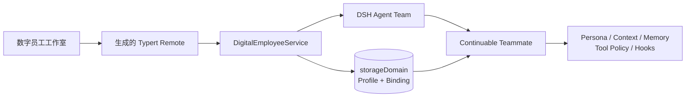

# DSH Agent Team Ultra

Agent Team Ultra 是一个依赖 DeepSeek Harness（DSH）的本地插件工作区。它在 DSH Web 的会话头部加入“数字员工工作室”，把可视化配置的 Agent Profile 创建为真实、可持续恢复的 Agent Team 队友。

当前实现绑定 DSH `0.1.2-alpha.4` 与提交 `4e84901e6471b79ec0338099867ebb4606d12bb5`。由于上游 Agent Team 包仍为 private，本项目明确采用 local-only 交付，不声称可以从 npm 独立安装。

## 能力

- 身份：Profile ID、队友名称、显示名称、职责描述。
- 运行时：`fresh` 或 `fork` 上下文，以及 continuable provider。
- 人格与任务：独立的 persona、长期 mission 和每次创建时的 assignment。
- 工具栈：继承全部、仅允许所选、或禁用所选；Agent Team 自有协作工具由 Team 子作用域保留。
- 上下文与记忆：有序、可启停的上下文块和策展式长期记忆块。
- Hook：安全的声明式 `session-start`、`before-step`、`before-tool`、`after-tool` 行为，不执行任意 JavaScript 或 shell。
- 生命周期：Profile CAS 版本控制、不可变启动快照、创建前持久化绑定、冷恢复重建和完整 Fiber 清理。
- 工作台：分区式配置导航，窗口支持拖动、八方向缩放，并随可用视口自动收敛布局。



浏览器只维护编辑草稿。Host 负责校验、权限判断、版本冲突和持久化；Agent Team 继续负责 roster、mailbox、task、Session 恢复与子 Agent 销毁。Profile 通过同步 `agent/created` 生命周期安装到精确的 `agent.ctx`，在 `agent/session-start` 和首次提示词组装前生效。

## 开发与验证

前置条件：相邻目录存在已构建的 `deepseek-harness` checkout，且与 `dsh-reference.lock.json` 完全一致；也可以用 `DSH_HARNESS_ROOT` 指向它。

```sh
pnpm install
pnpm verify
```

`pnpm verify` 会依次完成：严格校验 Harness commit、文档摘要和链接产物新鲜度；Host/Client 构建；官方 Typert 代码生成；26 项单元、Cordis、Loader、Client 与生命周期测试；六包本地归档的干净安装和 browser-safe ESM 导入；以及真实源码链接 DSH Web profile 的 Host 解析、`--dump-config` 组合和随机端口启动检查。

## 安装到本地 DSH Web

先构建全部产物并生成审计归档：

```sh
pnpm run pack:local
```

该命令会先执行严格上下文校验和构建，然后在 `artifacts/agent-team-ultra/` 生成三个 Ultra 包与三个上游 private Agent Team 包。归档用于内容验收；固定版本的 DSH 公共 peers 尚未全部发布到 registry，因此可运行安装必须使用命令最后打印的六个源码 `link:`，让每个包从已审计 checkout 解析准确依赖。其形式如下：

```sh
dsh plugin --profile web add \
  "link:/absolute/path/to/deepseek-harness/packages/experimental/agent-team" \
  "link:/absolute/path/to/deepseek-harness/packages/experimental/tool-agent-team" \
  "link:/absolute/path/to/deepseek-harness/packages/experimental/client-ui-agent-team" \
  "link:/absolute/path/to/dsh-agent-team-ultra/packages/domain" \
  "link:/absolute/path/to/dsh-agent-team-ultra/packages/ui" \
  "link:/absolute/path/to/dsh-agent-team-ultra/packages/profile"
```

随后先检查最终配置，再启动 Web：

```sh
dsh --profile web --dump-config
dsh web
```

配置结果中应出现 `agent-team`、`tool-agent-team`、`agent-team-ultra`、`ui-agent-team` 和 `ui-agent-team-ultra` 五个稳定行，同时三个冲突的全局 continuable 控制工具保持禁用。

## 使用

在 DSH Web 中打开 Lead 会话，点击会话头部的“数字员工”：

1. 新建 Profile，填写身份、persona 和 mission。
2. 选择 `fresh` 或 `fork`，再配置可继承工具、上下文、记忆和 Hook。
3. 保存 Profile；保存使用 `expectedRevision`，过期编辑不会覆盖新版本。
4. 可选填写本次任务，点击“创建数字员工”。
5. 左侧实例列表显示准备中、已激活或失败状态，以及该员工绑定的 Profile revision。

修改 Profile 只影响后续创建。已经创建或冷恢复的员工始终使用其绑定的不可变快照。

## 配置

| 字段 | 默认值 | 含义 |
|---|---:|---|
| `defaultProvider` | `spawn` | Profile provider 留空时使用的 continuable provider |
| `maxProfiles` | `64` | 持久 Profile 数量上限 |
| `maxProfileBytes` | `131072` | 单个规范化 Profile 的 UTF-8 字节上限 |
| `maxHooks` | `32` | 单个 Profile 的 Hook 数量上限 |
| `maxAssignmentBytes` | `32768` | 单次创建任务说明的 UTF-8 字节上限 |

部署值位于 [cordis.patch.yml](packages/profile/cordis.patch.yml)。DSH patch 会替换目标行的完整配置；覆盖时应重述需要保留的全部字段。

## 记忆、Token 与缓存

Profile memory 是人工策展的提示词内容，不是自动学习数据库。员工自己的持久 Session 提供情节式对话记忆；冷恢复时插件会用已绑定快照重新安装 persona、context、memory、工具策略和 Hook。

插件本身不额外调用模型。启用的 persona、mission、context、memory，以及运行时 Hook 注入会增加模型输入 Token；`fork` 还会继承 Lead 已完成轮次，通常比 `fresh` 使用更多上下文。稳定的 Profile 前缀可能有利于提供方 KV cache，但具体命中由 DSH 的模型适配器和提供方决定。

## 安全与边界

- Remote 请求携带 Session ID，Host 必须将它解析为当前 live Agent，再从 Agent Team 推导 membership；浏览器不能声明 Team、角色或 member 身份。
- 只有当前 Team 的 Lead 可以创建数字员工。
- Profile Head、不可变 Revision 和绑定写入独立的 `agent_team_ultra_v1` 分记录存储；旧 `agent_team_ultra` v0 仅作为只读迁移源，完成后不再打开。
- v1 迁移以显式格式标记为准，支持 JSON/SQLite 上的幂等崩溃恢复；未知、更高版本或分歧数据会拒绝启动，完成迁移后不支持回退到写 v0 的旧二进制。
- 绑定先进入 `pending`，再调用 Agent Team provisioning，避免子 Agent 在没有 Profile 快照的情况下启动。
- 工具名称在创建时相对当前 Lead 的工具目录再次校验；`before-tool` Hook 只能声明拒绝规则。
- Profile 不包含凭据字段，也不会把 API key 或其他 secret 传给 Client。

## 代码结构

- `packages/domain`：Host 服务、存储 schema、生成的 Remote 合约和 child-scope 安装。
- `packages/ui`：浏览器 Remote 挂载、React 工作台、CSS Modules 与中英文文案。
- `packages/profile`：可安装的本地 bundle patch 和冲突消解。
- `scripts/generate-typert.mjs`：在隔离分析工作区调用官方 DSH Typert generator，不修改 Harness checkout。
- `scripts/verify-pack.mjs`：归档白名单、干净安装、普通解析和真实 DSH profile 组合门禁。

接手开发请先阅读 [交接文档](docs/HANDOFF.md)。更严格的运行时与交付约束见 [项目合约](docs/agent/PROJECT_CONTRACT.md)、[本地 overlay 决策](docs/decisions/0001-local-overlay-and-sidecar-state.md) 和 [v1 存储代际决策](docs/adr/0002-isolate-the-v1-storage-generation.md)。

## 当前限制

- 仅支持同一进程内的现有 Agent Team，不支持嵌套 Team 或跨进程 Team 消息。
- 不热更新已存在员工的 Profile，不自动写回策展记忆。
- Hook 不执行用户代码；首版仅提供上下文注入和工具拒绝。
- 不提供托管 worktree、自动任务所有权、Profile 导入导出或 secret reference。
- 自动化无凭据测试覆盖完整组合与协议边界；2026-08-30 已在隔离 Profile 完成一次真实模型 Web 创建与冷恢复验收，后续变更仍应在目标 DSH 安装中复验。
