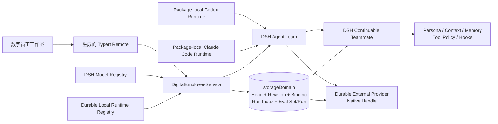

# DSH Agent Team Ultra

Agent Team Ultra 是一个依赖 DeepSeek Harness（DSH）的本地插件工作区。它在 DSH Web 的会话头部加入“数字员工工作室”，把可视化配置的 Agent Profile 创建为真实、可持续恢复的 Agent Team 队友。

本项目由 `benz-ai-x` 维护，五个自有包使用 `@benz-ai-x` 命名空间：

- `@benz-ai-x/dsh-agent-team-ultra`：Host 服务与 Remote 合约。
- `@benz-ai-x/dsh-client-ui-agent-team-ultra`：浏览器工作室。
- `@benz-ai-x/dsh-agent-team-ultra-profile`：本地安装组合包。
- `@benz-ai-x/dsh-agent-team-codex`：耐久 Codex 产品适配器。
- `@benz-ai-x/dsh-agent-team-claude-code`：耐久 Claude Code 产品适配器。

锁定 Harness 提供的依赖保留 `@deepseek-ai` 包名。命名与升级边界见 [ADR-0014](docs/adr/0014-own-ultra-packages-under-benz-ai-x.md)。

当前实现绑定 DSH `0.1.2-rc.1` 兼容源码分支与提交 `8b4bae0b620cc89a987a3ec6dd8b0b7d9025649a`，以 [reference lock](dsh-reference.lock.json) 为准。该 source-linked fork 为 Agent Team 增加精确 teammate route、耐久外部 teammate runtime、稳定 native turn 关联、规范 evidence/usage、隔离 candidate evaluation、固定包内 Codex/Claude Code Runtime Backend 和初始工作持久接受后的取消权转移；由于相关包仍为 private，本项目明确采用 local-only 交付，不声称可以从 npm 独立安装。

## 下一版本规格

[Spec #18：Agent Team Ultra vNext（规范版本 1.1）](https://github.com/benz-ai-x/dsh-agent-team-ultra/issues/18) 以“官方基础＋明确的 Ultra 扩展”为目标，中文为规范主版，附完整英文对照。待交付范围包括 native 完整协作、团队消息中心、任务 DAG 交互、扩展格式迁移和升级验收；这些能力尚未因 Spec 发布而完成实现。

当前实现与官方基线的差异及复现证据见 [兼容性核验报告](docs/research/2026-09-05-official-agent-team-compatibility.md)。

## 能力

- 身份：Profile ID、队友名称、显示名称、职责描述。
- 运行时：从 Host 实时目录选择并固定精确的 DSH 模型或耐久本地 Agent；目录只公开可执行的上下文、Profile 与运行能力，provider 凭据和原生对象留在 Host。
- Codex：使用固定 `@openai/codex` `0.149.1` 包内原生载荷维护非临时 app-server thread；默认只读沙箱、拒绝审批且禁用网络，不搜索或回退到 `PATH` 中的 Codex。
- Claude Code：使用固定 Claude Agent SDK `0.3.241` 与 Claude Code `2.1.241` 包内原生载荷维护稳定 Session；冷恢复校验原生 transcript，固定只读工具与沙箱，不搜索或回退到 `PATH` 中的 Claude。
- 人格与任务：独立的 persona、长期 mission 和每次创建时的 assignment。
- 工具栈：继承全部、仅允许所选、或禁用所选；Agent Team 自有协作工具由 Team 子作用域保留。
- 上下文与记忆：有序、可启停的上下文块和策展式长期记忆块。
- Hook：安全的声明式 `session-start`、`before-step`、`before-tool`、`after-tool` 行为，不执行任意 JavaScript 或 shell。
- 生命周期：不可变 Profile Revision、内容指纹、Head CAS、显式激活/回滚、归档/恢复、不可变启动快照和完整 Fiber 清理。
- 启动可靠性：Client 为一次启动意图生成 UUID，Host 按 Team 幂等处理并从权威 roster 恢复中断的 Binding；外部 provider 在 active 前返回稳定 native handle，重启与 provider 回归只恢复该 handle，不重复创建员工。
- Run 证据：每个已接受工作轮次确定性映射为一个有界、可重建 Run；列表仅保存身份、路由、终态、provider 报告的用量和完整性，详情按需从 DSH Session 或外部原生 turn 脱敏折叠。
- 候选评测：每个 Profile 可拥有独立版本化 Eval Set；每个 Case 在全新、只读、无审批的非 roster 运行时执行，精确记录 Profile/Eval Set/运行时世代/环境指纹，取消、崩溃和缺失证据绝不推断为通过。
- 发布门禁：Profile Head 可要求一个精确 Eval Set Revision；只有仍匹配当前候选、能力世代、断言 schema 和隔离环境的 passed Eval Run 才允许激活，评测本身不会自动发布。
- 工作台：Profiles、Runtime Backends、Revisions、Instances、Runs、Evaluations 六个入口，以及 Eval Set 编辑、评测证据和有界版本差异；窗口支持拖动、八方向缩放，并随可用视口自动收敛布局。
- 实时投影：每个连接世代先接收完整 Host baseline，再按合并后的 domain/runtime/roster/turn/eval 失效信号整体替换；断线保留最后完整快照并标为 stale，终止连接单独显示 disconnected，迟到的一次性读取不能覆盖新世代。



浏览器只维护编辑草稿。Host 负责校验、权限判断、版本冲突和持久化；Agent Team 继续负责 roster、mailbox、task、Session 恢复与子 Agent 销毁。Profile 通过同步 `agent/created` 生命周期安装到精确的 `agent.ctx`，在 `agent/session-start` 和首次提示词组装前生效。

## 开发与验证

前置条件：准备一份已构建且与 `dsh-reference.lock.json` 完全一致的 Harness checkout。首次准备默认选择相邻 `../deepseek-harness`；也可以指定任意隔离目录：

```sh
DSH_HARNESS_ROOT=/absolute/path/to/locked-harness pnpm prepare:harness
pnpm install
pnpm verify
```

`prepare:harness` 先核验 commit、文档摘要和源码状态，再建立仓库内忽略跟踪的 `.dsh/harness` 链接，并输出实际源码路径及来源证明。后续命令沿用这份选择；相对 `DSH_HARNESS_ROOT` 始终从 Ultra 仓库根目录解析，与执行目录无关。切换选择时重新执行准备和依赖安装，准备过程只调整本仓库链接，不切换 Harness checkout，也不访问应用的 `DSH_HOME`。

依赖链接、TypeScript、Vitest 的源码别名、Typert 生成和打包均使用这份选择。检查器同时核对声明路径与 `node_modules` 实际解析；混入其他来源会报告实际路径并拒绝继续。需要并行验证其他源码时，先建立独立 Ultra checkout，再在其中执行相同准备步骤。

`pnpm verify` 会依次完成：严格校验 Harness commit、文档摘要、源码来源和链接产物新鲜度；Host/Client 构建；官方 Typert 代码生成；完整的单元、Cordis、Loader、Client 与生命周期测试；八包本地归档的干净安装及两类原生运行时解析；真实 DSH Web profile 的组合/启动；最后卸载并检查 Loader 与包残留。

## 安装到本地 DSH Web

先构建全部产物并生成审计归档：

```sh
pnpm run pack:local
```

该命令会先执行严格上下文校验和构建，然后在 `artifacts/agent-team-ultra/` 生成五个 Ultra 包与三个锁定 Harness private Agent Team 包。固定版本的部分 DSH peers 尚未发布到 registry，因此命令会打印完整的本地安装指令：八个产品包使用 `file:` 归档，未发布 peers 使用锁定 Harness checkout 的 `link:`。使用本次打印的八个归档路径，勿用目录通配符包含历史旧包；核心形式如下：

```text
node scripts/compatible-dsh.mjs plugin --profile web add <八个 file: 归档参数> <锁定 Harness 的 link: peer 参数>
```

随后先检查最终配置，再启动 Web：

```sh
pnpm compatibility:check
pnpm dsh:checked --profile web --dump-config
DSH_HOME=/absolute/path/to/isolated-dsh-home pnpm dsh:checked web --no-open --port 4317
```

安装与启动必须使用同一个 `DSH_HOME`；上例路径需要替换为安装时所用路径，端口需选择未占用值。打印的安装命令使用本仓库绝对路径的预检入口，仍调用所选锁定 CLI。安装前核对源码、文档和构建产物，安装完成后及每次启动前检查真实依赖；错误提交、缺包、同版本错误产物或不合格 SDK 返回 `ULTRA_COMPAT_*` 诊断，拒绝加载业务服务。

配置结果中应在 `agent-team-ultra-compatibility` 组内出现 `agent-team`、`agent-team-codex`、`agent-team-claude-code`、`tool-agent-team`、`agent-team-ultra`、`ui-agent-team` 和 `ui-agent-team-ultra` 七个稳定行。组入口在预检成功后才交给 Loader 加载子插件。直接导入 Host 包也会先检查；Client 入口保持浏览器安全。两个冲突的全局 continuable 控制行禁用，普通 `subagent` 与 `subagent_fork` 保持 one-shot。

官方基础、维护 fork、文档摘要、扩展接口资格、Session/Team/投影/Ultra 格式和 native SDK/payload 版本分别记录在锁文件中。相同包版本不代表兼容，较新官方 `d347e7` 目前只用于对照；详见 [兼容性 ADR](docs/adr/0015-maintain-explicit-harness-compatibility.md) 和 [补丁清单](docs/reference/harness-patch-ledger.md)。固定官方源码构建完成后，可以运行 `pnpm compatibility:compare /absolute/path/to/official-d347e7`，重复官方/fork 的基础行为及拒绝导入验证。

`pack:local` 同时打印卸载命令。执行后，最终配置和 profile `node_modules` 中不得残留 Ultra、Codex 或 Claude Code overlay 行/包。

从旧命名空间升级时，先停止目标 Web 实例，使用旧版打印的卸载命令移除旧包，再执行新版打印的安装命令。沿用原 `DSH_HOME` 和 Profile，并在重启后刷新浏览器，使 Host、Client 与生成的 RPC 标识同步切换；会话与 `agent_team_ultra_v1` 数据继续保存在原位置。

如果 Host／Client／Profile 已经使用 `@benz-ai-x`，Codex 或 Claude Code 仍是旧包，则停止 Web 后，沿用同一 `DSH_HOME` 只执行对应已安装旧包的移除命令，再执行本次 `pack:local` 打印的完整安装命令：

```sh
node .dsh/harness/apps/cli/lib/bin.js plugin --profile web remove --config.offline=true --config.auto-install-peers=false @deepseek-ai/dsh-experimental-agent-team-codex
node .dsh/harness/apps/cli/lib/bin.js plugin --profile web remove --config.offline=true --config.auto-install-peers=false @deepseek-ai/dsh-experimental-agent-team-claude-code
```

保留 Profile 配置和所有 Session／Ultra／native 数据。`agent-team-codex`／`agent-team-claude-code` 行、`digitalEmployees` 服务、`external-agent/codex`／`external-agent/claude-code` 路由、Profile Revision、成员和 native handle 均沿用原身份。预检只接受 ESM 实际可解析的依赖；`NODE_PATH` 中的工作区副本不能补齐缺包。任一旧产品适配包仍在安装路径中时，Profile 会在子插件加载前返回 `ULTRA_COMPAT_LEGACY_RUNTIME`；先完成上述移除与安装流程。

升级验证使用独立干净的前身 checkout，已按该版本说明准备 Harness、安装依赖并完成构建：

- Codex：`pnpm verify:codex-upgrade /absolute/path/to/built-previous-checkout`，前身固定为 `61d23615bb8987e85f2397ed57b94ef23c79ade3`。
- Claude Code：`pnpm verify:claude-upgrade /absolute/path/to/built-previous-checkout`，前身固定为 `ae2ec7258146ea14ec4895d39795221c3774e29d`。

验证会在隔离 `DSH_HOME` 中打包和安装新旧归档，经真实 Loader、生成 Remote、JSON／SQLite 存储验证原身份恢复、后续消息、目录移除／回归、Web 启动及完整卸载。Codex app-server 通道和 Claude SDK API 使用确定性外部边界替身；发货 adapter、受控进程桥接、SDK/payload 资格检查与权限策略均使用实际归档代码。真实认证后的产品验收仍由 [#44](https://github.com/benz-ai-x/dsh-agent-team-ultra/issues/44) 完成。

## 只读升级审计

在已准备锁定 Harness 并执行 `pnpm build` 的本仓库中，对停止写入的 Session 与存储快照运行：

```sh
pnpm migration:audit --sessions /absolute/path/to/sessions --json /absolute/path/to/storage
pnpm migration:audit --sessions /absolute/path/to/sessions --sqlite /absolute/path/to/storage.sqlite
```

按实际后端选择其中一条。需要纯 JSON 输出时，使用 `node scripts/audit-migration.mjs` 加相同参数。成功退出 `0`，拒绝退出 `1` 并返回稳定的 `AUDIT_*` 原因。根目录和文件必须存在、没有符号链接；每个源文件上限 64 MiB，每个目录树上限 10,000 个文件。审计前后核对文件摘要，变化中的源须重新取得静止快照；报告只包含身份、版本、检查结果和计划，不含消息正文或 native transcript。

审计区分 Session codec、Team payload、projection stateVersion、descriptor 和 Ultra Generation，核验 Profile／Revision／Binding 与 Team、固定 route、native 身份及能力需求。未知或未来业务格式拒绝读取；不可用 checkpoint 则基于真实日志冷重建并报告原因，源缓存保持不变。v0 和 pending v1 只在内存中按现有 Host 规则投影、校验和判断重试冲突，不创建或补写目标库。SQLite 的数据库及 WAL 复制到临时目录后用只读连接检查，源 SHM 和数据库不会被 SQLite 打开或更新，临时副本在退出前清除。

报告中的阶段 C 计划保留 Session、成员、Profile Revision、任务／消息、Launch Request、native handle／turn、时间与 CAS，规定 pending 目标关闭业务写入、相同记录复用、冲突拒绝、完成标记最后提交和禁止双向写入。方案见 [ADR 0016](docs/adr/0016-audit-and-plan-format-aware-migration.md)。当前命令只审计，**不执行格式迁移**；阶段 A 验收后进入 B，当前运行锁仍为维护 fork `8b4bae0b…`，官方 `d347e7` 仍仅为对照与阶段 C 集成基础。

## 使用

在 DSH Web 中打开 Lead 会话，点击会话头部的“数字员工”：

1. 新建 Profile，填写身份、persona 和 mission。
2. 在分组目录中选择一个可用 Runtime Backend；DSH 模型会固定 provider/model/推理强度，本地 Agent 会固定耐久 provider id。
3. 选择 `fresh` 或 `fork` 及匹配的延续 Provider，再配置可继承工具、上下文、记忆和 Hook。
4. 保存候选 Revision；Runtime Target 和规范化 Required Capabilities 会参与指纹、历史和差异，过期编辑不会覆盖新版本。
5. 如需发布门禁，在“评测”页新建或编辑 Eval Set（Cases JSON、工具白名单、资源上限、通过策略），保存其独立不可变版本，并将最新版本设为当前 Profile 的激活要求。
6. 对精确候选发起 Eval Run；可取消运行、检查逐 Case 断言与规范证据，并和其他 Eval Run 对比。只有当前门禁显示“已通过”时，受门禁的候选才能激活。
7. 在“版本”页检查指纹及相对已激活版本的结构化差异，再显式激活最新候选（也可回滚到更早的不可变版本）。
8. 可选填写本次任务，点击“创建数字员工”；只有未归档 Profile 的 `activeRevision` 可以启动。
9. 左侧实例列表分别显示持久的创建阶段、当前运行时可用性和进程驻留状态，以及该员工绑定的 Profile revision、所选运行目标与实际解析目标；外部员工还保留不透明 native handle。
10. 在 Run 列表按证据来源或终态筛选；打开详情时才读取有界规范时间线，并明确显示脱敏项、截断和证据不完整/不可用状态。

修改 Profile 或改变 Lead/部署默认路由只影响后续创建。已经创建或冷恢复的员工始终使用其绑定的不可变快照与 continuation descriptor 固定路由。编辑时可以原样保留最新但暂时离线的历史目标；新选离线目标、激活和启动仍会稳定失败且绝不回退。

## 配置

| 字段 | 默认值 | 含义 |
|---|---:|---|
| `defaultContinuationProvider` | `spawn` | Profile 延续 Provider 留空时使用的默认值；旧 `defaultProvider` 仅作迁移别名 |
| `maxProfiles` | `64` | 持久 Profile 数量上限 |
| `maxProfileBytes` | `131072` | 单个规范化 Profile 的 UTF-8 字节上限 |
| `maxHooks` | `32` | 单个 Profile 的 Hook 数量上限 |
| `maxAssignmentBytes` | `32768` | 单次创建任务说明的 UTF-8 字节上限 |
| `maxRevisionHistory` | `32` | Studio 每个 Profile 返回的版本摘要上限 |
| `maxDiffEntries` | `512` | 单次版本结构化差异返回项上限 |
| `maxRuns` | `512` | 持久 Run 索引保留的最新记录上限 |
| `maxRunEvidenceItems` | `512` | 单次 Run 详情最多折叠的规范 evidence 条目数 |
| `maxEvalSets` | `64` | 持久 Eval Set Head 数量上限 |
| `maxEvalSetBytes` | `262144` | 单个规范化 Eval Set Revision 的 UTF-8 字节上限 |
| `maxEvalCases` | `64` | 单个 Eval Set 的 Case 数量上限 |
| `maxEvalRuns` | `256` | 持久终态 Eval Run 的最新记录上限；运行中记录不会因保留策略被删除 |

部署值位于 [cordis.patch.yml](packages/profile/cordis.patch.yml)。DSH patch 会替换目标行的完整配置；覆盖时应重述需要保留的全部字段。

## 记忆、Token 与缓存

Profile memory 是人工策展的提示词内容，不是自动学习数据库。DSH 模型员工由其持久 child Session 提供情节式对话记忆；外部员工的原生 session 与历史由对应 provider 管理，Ultra 只持久化精确 handle 和关联。冷恢复时插件会把已绑定快照交给所选运行时，并要求外部 provider 恢复同一 handle。

DSH 分支不在 child Agent 之外额外调用模型；启用的 persona、mission、context、memory 和运行时 Hook 会增加模型输入 Token，`fork` 还会继承 Lead 已完成轮次。外部分支如何把 Profile、初始工作和 mailbox turn 映射为模型调用、Token 与 KV cache，由 provider 定义。稳定 Profile 前缀可能有利于缓存，但具体命中同样由实际适配器和 provider 决定。

## 安全与边界

- Remote 请求携带 Session ID，Host 必须将它解析为当前 live Agent，再从 Agent Team 推导 membership；浏览器不能声明 Team、角色或 member 身份。
- 只有当前 Team 的 Lead 可以创建数字员工。
- Profile Head、不可变 Revision 和绑定写入独立的 `agent_team_ultra_v1` 分记录存储；旧 `agent_team_ultra` v0 仅作为只读迁移源，完成后不再打开。
- Profile 无硬删除；归档保留完整历史与绑定但阻止激活和启动，恢复必须经过 Head CAS。
- v1 迁移以显式格式标记为准，支持 JSON/SQLite 上的幂等崩溃恢复；未知、更高版本或分歧数据会拒绝启动，完成迁移后不支持回退到写 v0 的旧二进制。
- 绑定先记录 Team-scoped Launch Request ID、请求指纹、assignment 哈希、能力世代和完整 Revision/路由快照，并持久为 `pending`，再调用 Agent Team provisioning。
- 重启和实时 Team 事件会以权威 roster 修复矛盾 Binding；相同启动意图返回现有 Binding，改变输入则稳定拒绝。
- 工具名称在创建时相对当前 Lead 的工具目录再次校验；`before-tool` Hook 可按 Profile 顺序声明拒绝或精确调用审批。
- Runtime Catalog 只包含白名单化的展示、可用性、上下文、能力和推理元数据；API key、endpoint、环境值、本机路径、登录状态及 live adapter 均不会传给 Client。
- 耐久外部 provider 与 Agent Team 共用一个 Fiber 生命周期：移除时立即停止新调用，在 cleanup 宽限期后发出中止信号但继续等待实际静止，并只释放该 generation 的 runtime/evaluation handle；其他 provider 不受影响。
- Codex adapter 只在固定包内原生载荷及其版本通过资格校验时注册；它保留稳定 thread identity，幂等处理启动与 mailbox turn，并在 interrupt、崩溃修复或 Fiber disposal 时只清理精确 handle。
- Claude Code adapter 只在固定 SDK/native 载荷通过资格校验时注册；它以确定性 Session id 幂等启动，逐条串行处理 mailbox turn，冷恢复先核验 transcript 身份，并在 interrupt 或 Fiber disposal 时只终止精确 Query/process tree。
- 外部 mailbox、interrupt 与 evidence 始终使用精确 provider/native handle；隔离 evaluation 使用自己的 evaluation id/handle。评测运行时不进入 Team roster 或生产 workspace，结果持久化后才释放精确 handle；两类操作都不会回退到一次性 Codex/Claude subagent。
- Run Index 不复制 prompt、reply、tool argument/result、文件、环境值、credential 或原始 provider payload；详情只从规范来源按需折叠，缺失、截断和未知终态必须显式可见。
- Profile 不包含凭据字段，也不会把 API key 或其他 secret 传给 Client。

## 代码结构

- `packages/domain`：Host 服务、存储 schema、生成的 Remote 合约和 child-scope 安装。
- `packages/ui`：浏览器 Remote 挂载、React 工作台、CSS Modules 与中英文文案。
- `packages/profile`：可安装的本地 bundle patch 和冲突消解。
- `scripts/generate-typert.mjs`：在隔离分析工作区调用官方 DSH Typert generator，不修改 Harness checkout。
- `scripts/verify-pack.mjs`：归档白名单、干净安装、普通解析和真实 DSH profile 组合门禁。

接手开发请先阅读 [交接文档](HANDOFF.md)。更严格的运行时与交付约束见 [项目合约](docs/agent/PROJECT_CONTRACT.md)、[本地 overlay 决策](docs/decisions/0001-local-overlay-and-sidecar-state.md)、[v1 存储代际决策](docs/adr/0002-isolate-the-v1-storage-generation.md)、[Profile 发布生命周期决策](docs/adr/0003-separate-profile-authoring-from-release.md)、[能力感知 Runtime Target 决策](docs/adr/0004-pin-capability-aware-runtime-targets.md)、[启动意图持久化决策](docs/adr/0005-make-launch-intent-durable.md)、[耐久外部 teammate seam 决策](docs/adr/0006-use-durable-external-teammate-runtime.md)、[包内 Codex Runtime 决策](docs/adr/0007-activate-package-local-codex-runtime.md)、[包内 Claude Code Runtime 决策](docs/adr/0008-activate-package-local-claude-code-runtime.md)、[可信 Run 证据决策](docs/adr/0009-index-runs-and-fold-canonical-evidence-lazily.md)、[库存审批决策](docs/adr/0010-reuse-stock-exact-call-approval.md)、[精确隔离评测门禁决策](docs/adr/0011-gate-promotion-with-exact-isolated-evaluations.md) 和 [完整 Studio 快照流决策](docs/adr/0012-stream-complete-studio-snapshots.md)。

## 当前限制

- 仅支持同一进程内的现有 Agent Team，不支持嵌套 Team 或跨进程 Team 消息。
- 不热更新已存在员工的 Profile，不自动写回策展记忆。
- Hook 不执行用户代码；仅提供上下文注入、工具拒绝和复用 DSH 库存审批的一次性精确调用授权。
- 固定包内 Codex `0.149.1` 或 Claude Agent SDK `0.3.241`/Claude Code `2.1.241` 未通过资格校验时，对应路由会显示为不可用。Claude Code 仅接受 fresh 上下文、继承工具策略且不支持 Hook、exact-call approval 或 evaluation；历史中暂时缺失的目标可原样保留但显示为不可用，激活或启动不会回退到 Lead 路由。
- 不提供托管 worktree、自动任务所有权、Profile 导入导出或 secret reference。
- 自动化无凭据测试覆盖完整组合与协议边界；2026-08-30 已在隔离 Profile 完成一次真实模型 Web 创建与冷恢复验收，后续变更仍应在目标 DSH 安装中复验。
