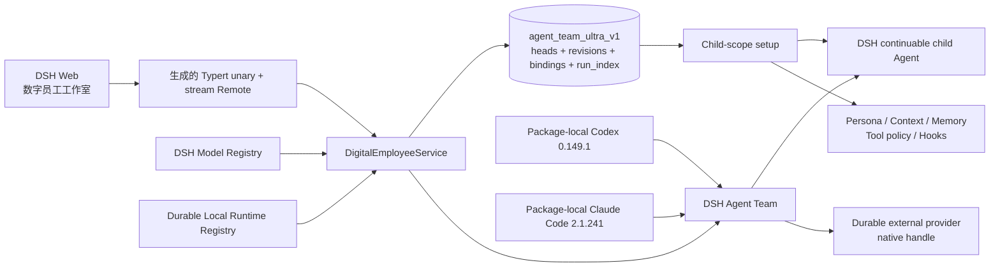

# DSH Agent Team Ultra 交接文档

> 交接快照：2026-09-03（Asia/Shanghai）
>
> 当前阶段：全部可信开发轮次已完成；除既有精确路由、耐久 Runtime、Run 证据和隔离评测外，Studio 完整快照流、代际监督、生命周期静止及归档安装/卸载证明均已落地。

## 1. 接手结论

本项目是依赖 DeepSeek Harness（DSH）的本地 Agent Team 强化插件。当前版本已经可以在 DSH Web 中可视化维护 Agent Profile，并把 Profile 创建为真实、可恢复的 Agent Team 队友。Profile 覆盖命名、精确 Runtime Target、独立 continuationProvider、上下文模式、persona、mission、工具策略、上下文块、策展记忆和声明式 Hook。

接手后先运行：

```sh
pnpm install
pnpm context:check:strict
pnpm verify
```

只有严格上下文检查通过后才应修改代码。项目当前绑定的 Harness 基线是：

| 项目 | 固定值 |
|---|---|
| DSH 版本 | `0.1.2-alpha.4` |
| Harness source fork | `https://github.com/benz-ai-x/deepseek-harness.git` |
| Harness commit | `13d301be906ddf60a6e2a09ea86465726cc42edf` |
| Harness docs digest | `37732ed5e550a6d201b6dc48001fde0c8e0c8d163e920cd69853d872b5b0bae4` |
| Node.js | `^22.19.0 || >=24.0.0` |
| pnpm | `11.7.0` |
| 交付方式 | local-only、八个 `file:` 归档 + 锁定 Harness peer `link:` |

固定值的唯一机器可读来源是 [`dsh-reference.lock.json`](../dsh-reference.lock.json)。默认 Harness checkout 位于相邻目录 `../deepseek-harness`，也可以通过 `DSH_HARNESS_ROOT` 指定。

## 2. 当前仓库状态

- 分支：`main`
- 远端：`git@github.com:benz-ai-x/dsh-agent-team-ultra.git`
- 本快照对应 Issue #14 的完整实现；最终提交以远端 `main` 的 HEAD 为准。
- 锁定 Harness checkout 位于 `/root/workspace/deepseek-harness`，并在 source fork 分支 `agent-team-ultra-pinned-route` 的固定 commit 上保持干净。
- 2026-08-30 的 credentialed 人工验收未重复执行；本次 credential-free 套件覆盖完整工作流，并通过八归档安装、双原生运行时解析、真实 Web 组合启动和残留为零的卸载门禁。
- 本地启动应使用锁定源码 CLI 或与锁定版本一致的 CLI，并使用隔离的 `DSH_HOME`。

交接文档不会记录 API key、凭据正文、临时 Web token 或 Session URL。隔离 Profile 只应保留在本机，不能提交进仓库。

## 3. 系统边界与数据流



职责边界如下：

| 模块 | 责任 | 关键入口 |
|---|---|---|
| `packages/domain` | Host 服务、schema、CAS、持久绑定、child-scope 能力安装、Typert 合约 | [`src/index.ts`](../packages/domain/src/index.ts)、[`src/spec.ts`](../packages/domain/src/spec.ts)、[`src/types.ts`](../packages/domain/src/types.ts) |
| `packages/ui` | Web Remote 挂载、会话头部 Slot、Profile 编辑器、中英文文案 | [`Studio.tsx`](../packages/ui/src/client/Studio.tsx)、[`mount.ts`](../packages/ui/src/client/mount.ts) |
| `packages/profile` | 组合 Ultra 与上游 Agent Team，关闭冲突工具行 | [`cordis.patch.yml`](../packages/profile/cordis.patch.yml) |
| `scripts` | 上游契约锁定、Typert 生成、本地打包和真实 DSH 启动门禁 | [`verify-dsh-context.mjs`](../scripts/verify-dsh-context.mjs)、[`verify-pack.mjs`](../scripts/verify-pack.mjs) |

Host 依赖 `agents`、`agentTeams`、`llm`、`sessionPersistence`、`storageDomain`、`subagents`、`systemPrompt` 和 `tools` 八项 DSH 服务。浏览器只维护草稿和显示结果，不拥有权限、运行时目录或持久化真相。

## 4. 不可破坏的实现约束

### 权限

- Remote 只接收 Session ID；Host 必须通过 `ctx.agents.get()` 解析为当前精确的 live `Agent`。
- Team、角色和 member 身份必须由 Agent Team 服务推导，不能相信 Client 声明。
- 只有当前 Team 的精确 live Lead 能创建数字员工或运行候选评测。
- 查看、保存、Eval Set/Gate/Run 操作、激活、回滚、归档、恢复和启动都要求精确 live Team Lead。

### 持久化与恢复

- Profile Head、不可变 Profile Revision 和 Team/member Binding 写入独立的分记录 storage generation `agent_team_ultra_v1`；`agent_team_ultra` v0 仅是只读迁移源。
- `profile_heads` 保存 CAS、latest/active 指针和归档状态；`profile_revisions` 保存完整规范化内容、Runtime Target、Required Capabilities 与 SHA-256 指纹；`bindings` 还保存 Team-scoped Launch Request ID、请求/Profile/assignment 指纹、能力世代、保留成员名、成员 ID、不可变 Revision/Profile/能力快照、所选 Runtime Target、独立的 Preflight Runtime Target 和 `pending | active | failed` Provisioning Phase。Resolved Runtime Target 只在 DSH child descriptor 或外部 provider 的稳定 native handle 完成证明后出现。
- `run_index` 只保存有界、可重建的 Run 身份、Team-member 或 evaluation-worker 判别身份、不可变 Profile/路由关联、终态、provider 报告的 usage、时间戳与 evidence completeness。DSH child Session 或外部 provider-native turn 才是规范证据；prompt/reply、tool 参数/结果、文件、环境值、凭据和原始 payload 不进入索引或规范时间线。
- `eval_sets` 以独立 Head CAS 管理 Profile-owned Eval Set 的不可变版本；`eval_runs` 在执行前固定 Team、Profile/Eval Set Revision 与指纹、Runtime Target、能力世代、断言 schema、有效工具白名单和环境指纹，并持久化逐 Case 规范结果。运行中记录不受终态保留清理影响，重启一律修复为 interrupted。
- 创建流程必须先持久化完整 `pending` Binding，再调用 Agent Team provisioning。assignment 正文只用于初始工作，不进入 Binding。
- Client 每个 Launch Intent 只生成一个 UUID；传输失败和 `pending` 重试复用它。Host 以 Team + Launch Request ID 去重，相同输入返回当前 Binding，改变输入返回 `launch-request-conflict`。
- Studio `view` 与 `watch` 共用一个 Host 快照 builder；每个 stream 世代以完整 baseline 开场，后续 domain/runtime/roster/turn/eval 失效只发布合并后的完整替换。Client 在承载丢失时保留最后完整快照并显示 stale，终止连接显示 disconnected，迟到 unary 结果受世代栅栏约束。
- 启动、实时 Team 事件、Runtime Backend 世代和 Studio 读取均会以权威 roster 修复矛盾 Binding，但不会创建替代员工。Provisioning Phase 持久；Runtime Availability 与 Runtime Presence 分别由当前目录和精确 live Agent 派生。
- dsh-model 创建会在 pending Binding 前重新解析精确 adapter 路由，把规范化 provider/model/reasoning options 原样交给 Agent Team，并在 active Binding 前核对 child continuation descriptor；任何 alias 或不一致都会以稳定错误失败，不采用 Lead/default 回退。
- external-agent 创建通过 Agent Team 的 typed durable runtime seam，携带相同 Launch Request ID 与预留 member identity；provider 必须在 active 前返回稳定 opaque native handle。provider 缺失只令实例 unavailable/inactive，回归时恢复同一 handle，mailbox 和 interrupt 不会转成一次性 subagent。
- Codex adapter 只使用固定 `@openai/codex` `0.149.1` 包内原生载荷，不搜索 `PATH`；资格失败即不注册。它以非临时 app-server thread 作为稳定 native handle，默认只读沙箱、审批 `never`、禁用网络，并对证据和外部错误做有界净化。
- Claude Code adapter 只使用固定 Agent SDK `0.3.241` 与 Claude Code `2.1.241` 包内原生载荷，不搜索 `PATH`；资格失败即不注册。它以确定性 Session id 作为稳定 native handle，冷恢复核验 transcript 身份，串行并去重 mailbox turn，并固定 `Read`/`Glob`/`Grep`、只读沙箱和无网络策略。
- 已创建员工始终使用绑定时的快照。后续候选、激活、回滚或归档不会热更新已有员工。
- 不要向 DSH 的闭集 Session event catalog 添加自定义事件；本插件使用独立 storage domain。
- 不兼容格式必须使用新的 Storage Generation 名称，不能提升现有分记录 envelope version 伪装原地迁移。

### 工具、提示词与 Hook

- 工具策略支持 `inherit`、`allow`、`deny`。工具名在创建时相对当前 Lead 的真实工具目录再次校验。
- Agent Team 自有协作工具不进入 Profile 选择列表，也不能被 Profile 过滤掉；它们由 Team child scope 安装。
- persona 使用 system-prompt section；context 和 memory 使用有序 context section。
- Hook 只允许安全的声明式行为：

  - `session-start`：注入上下文。
  - `before-step`：在步骤前注入上下文。
  - `before-tool`：按支持 `*` 的工具 matcher 拒绝调用，或通过 DSH 库存审批请求一次性精确调用授权；首个启用匹配项生效。
  - `after-tool`：按 matcher 追加上下文。

- Hook 不执行任意 JavaScript、shell 或用户代码。

### 并发与生命周期

- Profile 保存及 Head 发布操作使用 `expectedHeadRevision` compare-and-set；过期编辑必须返回当前 Head 和 `profile-conflict`，不能覆盖新版本。
- Eval Set 使用独立 `expectedHeadRevision` CAS；Profile Head 的 Gate 也复用 Profile CAS。激活只接受与最新 Candidate、所需 Eval Set Revision、能力世代、断言 schema 和环境仍精确匹配的 passed Eval Run。
- 读改写通过 Host mutation queue 串行化；Profile 对外和绑定内均使用深拷贝冻结快照。
- spawn 接受调用方取消信号；调用方只在 Agent Team 持久接受初始工作前拥有取消权，之后所有权转移给 Team runtime。
- 外部 provider registration 与贡献 Fiber 同生共死；移除会立即关闭准入，在 cleanup 宽限期后发出中止信号但继续等待实际静止，并只清理该 generation 挂载的 runtime/evaluation handle。
- 服务 dispose 时先关闭 admission，取消并等待已接纳 Eval Run 收敛，再撤销 child setup，等待已接纳 launch 和 mutation queue 收敛，最后关闭 storage domain。
- dispose 可取消尚未持久接受的 provisioning，但不会停止无关 child 或已归 Team 所有的 child。
- child-scope 能力必须逐项安装并按逆序释放；会话历史可见性不等于工具、权限或服务继承。

完整设计依据见 [`PROJECT_CONTRACT.md`](agent/PROJECT_CONTRACT.md) 和 [`0001-local-overlay-and-sidecar-state.md`](decisions/0001-local-overlay-and-sidecar-state.md)。

## 5. Remote 与错误语义

生成的 `digitalEmployees` Remote 提供十五个操作：

| 操作 | 用途 | 可取消 |
|---|---|---:|
| `view` | 获取完整可替换 Studio view：Profiles、Runtime Catalog、Lead 可继承工具、当前 Team 实例 | 否 |
| `watch` | 每个承载世代先发送完整 baseline，再发送合并失效后的完整替换快照 | 是 |
| `revision` | 读取一个不可变 Revision 及其相对 active 的有界差异 | 否 |
| `run` | 按需折叠一个 Run 的有界规范时间线，并显式返回完整、截断或不可用状态 | 是 |
| `save` | 按 `expectedHeadRevision` 保存候选 Revision | 否 |
| `saveEvalSet` | 按独立 Head CAS 保存不可变 Eval Set Revision | 否 |
| `setEvalGate` | 设置或清除 Profile Head 的精确 Eval Set 门禁 | 否 |
| `activate` | 显式激活最新候选 Revision | 否 |
| `rollback` | 将 active 指针回滚到已有更早 Revision | 否 |
| `archive` | 保留历史并阻止激活和启动 | 否 |
| `restore` | 恢复归档的 Profile Head | 否 |
| `spawn` | 使用 Client 提供的 Launch Request ID、active Revision 和可选 assignment 幂等创建队友 | 是 |
| `startEvalRun` | 以 Client UUID 启动精确候选评测；返回后由 Host 继续拥有运行 | 否 |
| `cancelEvalRun` | 取消并等待一个当前 Team 的运行中 Eval Run 收敛 | 否 |
| `evalRun` | 读取一个 Eval Run 的逐 Case 规范结果与 Eval Set 身份 | 否 |

业务拒绝通过成功 transport 内的 `{ ok: false, error }` 返回，transport 故障保持为异常。稳定业务码还包括 `profile-not-active`、`profile-archived`、`revision-not-found`、`run-not-found`、`evidence-unavailable`、`promotion-gate-failed`、`eval-invalid`、`eval-conflict`、`eval-environment-unavailable`、`eval-in-progress`、`eval-not-found`、`runtime-target-unavailable`、`runtime-route-invalid`、`runtime-capability-mismatch` 和 `launch-request-conflict`。

修改 Remote 装饰方法后必须重新运行构建；[`generate-typert.mjs`](../scripts/generate-typert.mjs) 会调用官方 Typert generator 更新 Host 与 Client 产物，不能手写生成文件。

## 6. 自动化验证

`pnpm verify` 是合并前总门禁，顺序如下：

1. 严格核对 Harness commit、文档摘要、声明版本和生成/链接产物新鲜度。
2. 构建 Host、Client、Profile 和 Typert Remote。
3. 运行 Vitest。
4. 检查打包白名单和干净消费者安装。
5. 创建临时真实 DSH Web Profile，安装八个归档及锁定 peer links，验证 Host import、双 Runtime、最终 Cordis 组合和随机端口监听。
6. 卸载八个 overlay 包，验证 Ultra、Codex、Claude Code Loader 行和安装目录均无残留。

2026-09-03 当前全量验证结果：

- 严格上下文检查：`284 passed, 0 warnings`。
- Vitest：`12` 个测试文件、`157` 个测试全部通过。
- 归档内容：Ultra domain `17` 个文件、UI `8` 个文件、Profile `4` 个文件，无源码、测试、source map 或 tsbuildinfo 泄漏。
- 八个归档可在干净消费者中安装，Codex/Claude Code Host 与 browser-safe ESM import 均正常解析。
- 八个归档及锁定 peer links 可被真实 DSH Profile 解析；最终配置包含全部七个稳定行，Web 可监听随机端口；随后卸载不残留 Ultra/Codex/Claude Code 行或包。

测试职责分布：

- `packages/domain/tests/profile-service.spec.ts`：schema、不可变 Revision、Head CAS、先绑定后 provisioning、Team-scoped 幂等、roster 对账、DSH/外部 Run 修复与详情、Lead 权限和 dispose 边界。
- `packages/domain/tests/run-evidence.spec.ts`：确定性 Run 身份、Team-member/evaluation-worker 判别身份、终态/usage 归一、索引/时间线限制和默认脱敏。
- `packages/domain/tests/pinned-route.integration.spec.ts`：真实 Agent Loop、Agent Team、JSONL 持久化、不可变 Profile scope、精确 route descriptor、外部 provider Run 重建与冷恢复端到端。
- `packages/domain/tests/evaluation.spec.ts`：Eval Set/环境/请求指纹、工具三方交集、确定性断言、通过策略和深冻结快照。
- `packages/domain/tests/generated-remote.spec.ts`：十五个生成 Remote 操作、流模式和 Client namespace。
- `packages/domain/tests/loader-composition.spec.ts`：真实 Loader 和部署限制。
- `packages/profile/tests/profile.spec.ts`：private bundle 与稳定、无冲突 Loader rows。
- `packages/ui/tests/studio.client.spec.tsx`：重复操作围栏、Launch Request ID 重试、三维实例状态、Session 切换、错误分层、launch 取消、Eval Set/Gate/Run/证据对比和独立 Client bundle。
- `packages/domain/tests/studio-feed.spec.ts`：完整 baseline、失效合并、取消与关闭 follower。
- `packages/ui/tests/mount.client.spec.ts`：Remote/Slot/流监督安装、销毁与失败回滚。

### 本次复验状态

本次提交的 `pnpm verify` 门禁包含 284 项严格上下文检查、Host/Client 构建、Typert 生成、157 项 Vitest、八归档/双 Runtime 安装、真实 DSH Web 启动及无残留卸载。

## 7. 真实模型与冷恢复验收证据

2026-08-30 已在隔离 Profile `agent-team-ultra-e2e` 完成一次人工 credentialed acceptance。凭据复用了本机既有 credential reference，没有复制到仓库或测试日志。

验收环境与对象：

- 模型路由：`zai-coding-cn / glm-5.3`。
- Lead 首次真实调用返回：`LEAD_MODEL_OK`。
- Web 创建的 Profile：`ultra-reviewer-0830-1505`，revision `1`。
- Profile 配置包含只允许所选工具、独立 context、memory 和 `session-start` Hook。

首个 child 真实响应同时包含：

```text
COLD_RESUME_OK
ULTRA_PROFILE_MARKER_0830_1505
CONTEXT_MARKER_0830_1505
MEMORY_MARKER_0830_1505
HOOK_MARKER_0830_1505
```

随后完整停止测试 Web 进程，确认监听消失，再用同一 DSH Home 和 Profile 重启。重新打开 Lead 使 live Agent/Team 激活后，Studio 恢复 Profile v1 与 active r1 绑定；恢复后的同一 child 第二次真实模型调用返回：

```text
COLD_RESUME_SECOND_CALL_OK ULTRA_PROFILE_MARKER_0830_1505 CONTEXT_MARKER_0830_1505 MEMORY_MARKER_0830_1505 HOOK_MARKER_0830_1505
```

一个重要运行时现象：进程刚重启、Lead 尚未重新打开时，历史 child 会先以只读历史存在；打开对应 Lead 后，Team 和 continuable child 才重新成为 live 对象。这符合 DSH 的 Session/Agent 激活模型，不应通过信任历史 Session ID 绕过。

## 8. 本机启动与复验 Runbook

使用锁定源码 CLI 和隔离的 DSH Home：

```sh
export DSH_HARNESS_ROOT=/absolute/path/to/deepseek-harness
export DSH_HOME=/absolute/path/to/isolated-dsh-home

node "$DSH_HARNESS_ROOT/apps/cli/lib/bin.js" \
  --profile web \
  --dump-config

node "$DSH_HARNESS_ROOT/apps/cli/lib/bin.js" \
  --profile web \
  --no-open --port 4317
```

先按 [`README.md`](../README.md#安装到本地-dsh-web) 把八个归档及锁定 peer links 安装到该隔离 Profile。端口被占用时换一个空闲端口，不要停止或修改用户已有的其他 DSH Web 进程。

重新做完整冷恢复验收时：

1. 用隔离 Profile 启动 Web，创建新的 Lead 会话并完成一次真实模型调用。
2. 在 Lead 会话头部打开“数字员工”，创建带唯一 marker 的 Profile。
3. 保存候选 Revision、显式激活，再创建员工，并让 child 返回 persona/context/memory/hook marker。
4. 正常停止该隔离 Web 进程，确认端口不再监听。
5. 使用相同 `DSH_HOME`、Profile 名和模型配置重启。
6. 先重新打开 Lead，再进入已恢复的 child。
7. 发起第二次真实模型调用；Profile revision、active binding、历史和全部 marker 都恢复才算通过。

若要创建一套全新的可运行安装，先运行：

```sh
pnpm run pack:local
```

该命令生成八个审计归档，并打印可直接执行的归档安装和卸载命令；未发布公共 peers 精确链接到锁定 Harness checkout。完整说明见 [`README.md`](../README.md#安装到本地-dsh-web)。

## 9. 已知限制与下一阶段

当前限制：

- 上游五个 Agent Team 包仍是 private，不能声称 npm 独立可安装。
- 只支持同一进程内的现有 Agent Team；不支持嵌套 Team 或跨进程 Team 消息。
- 已创建员工不热更新 Profile，策展记忆也不会自动写回。
- 不提供托管 worktree、自动任务所有权、Profile 导入导出或 secret-reference 字段。
- Hook 只支持上下文注入、工具拒绝与复用 DSH 库存审批的精确调用授权，不执行用户代码。

[`TODO.md`](../TODO.md) 中剩余工作按优先级建议为：

1. 在 DSH 提供可强制执行的 ownership seam 后增加可选 managed worktree。
2. 增加 Profile 导入/导出与 secret reference，同时确保凭据不经过浏览器或持久 Profile 明文传输。
3. 在任何 storage-domain 格式变化前实现迁移工具和失败恢复策略。
4. 上游 experimental Agent Team 包发布后，重新评估公开包和 registry 安装闭包。

## 10. 修改前后的检查清单

修改前：

- 完整阅读 [`AGENTS.md`](../AGENTS.md)、[`PROJECT_CONTRACT.md`](agent/PROJECT_CONTRACT.md)、[`TODO.md`](../TODO.md) 和 [`dsh-reference.lock.json`](../dsh-reference.lock.json)。
- 运行 `pnpm context:check:strict`。
- 确认锁定 Harness checkout 干净；不要在 Harness 源码目录生成或保留临时文件。
- 修改上游相关行为前先阅读锁定 checkout 中对应 subsystem 文档和真实实现。

修改后：

- 更新或新增最靠近行为边界的测试，不只测试 helper。
- Remote 变化后检查生成产物；Loader 变化后检查最终 `--dump-config`。
- 运行 `pnpm verify` 和 `git diff --check`。
- 涉及恢复、权限、取消、工具策略或模型提示词时，再做一次隔离 Profile 的人工真实 Web 验收。
- 检查 `git status`，确认没有凭据、Profile 数据、临时 token、归档或 Harness 工作区副作用进入提交。
