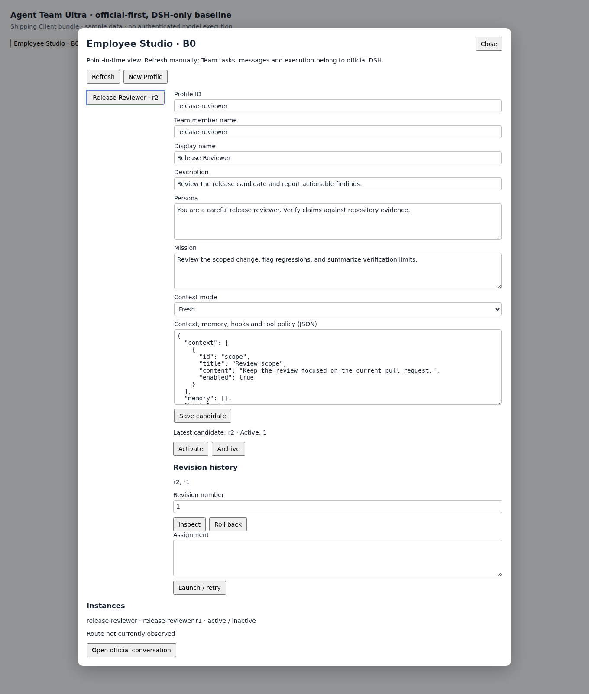

# B0 精简基线验收

日期：2026-09-09（Asia/Shanghai）。候选 `0.2.0-b0.1`；发布状态见 [根交接](../../HANDOFF.md)，本证据不构成合并许可。
范围：[ADR 0028](../adr/0028-establish-official-dsh-only-baseline.md)、
[项目契约](../agent/PROJECT_CONTRACT.md)、[TODO](../../TODO.md)。

## 结论

已完成官方优先、DSH-only 的代码／依赖／活动文档清理。
PR #64 初审发现三项问题，已补回归并修复；独立 Standards／Spec 复查均为 0 项，用户授权后已提交并推送修复。
修复后完整 `pnpm verify` 自然退出 0：61 项产品测试、18 项安装版联验及六归档安装／Web／卸载门禁通过。
B0-12 真实账号任务／人工浏览器验收未执行，不宣称生产可用、PR 审批通过或旧 Spec #18/#44 完成。

## 固定输入

| 输入 | 值 |
| --- | --- |
| Ultra 旧基线与 main | `f84584def627b4af78a029af8788de73da0ad567` |
| 工作分支 | `chore/official-dsh-only-baseline` |
| 已推送修复运行提交 | `dd5cfa8d9c63e9bdaa256b8718bd8bf635754e3d`；后续只同步发布文档 |
| 官方 Harness | `0.1.5-alpha.1` / `5dda764ed3aa172535a7967b06ff95d9cbfe536a` |
| docsDigest | `fde0d2d31418311ee2ca0cdbf07a163917e7affbe6d2720de27fda52cd0b6632` |
| 实际来源 | `.dsh/official-015`，由 `.dsh/harness` 统一引用 |
| Node / pnpm | 运行 Node 22.22.1；官方配置加载用 Node 24.11.1；pnpm 11.7.0 |
| 新数据 | Session 3、不压缩 JSONL、JSON domain `agent_team_ultra_b0` version 1 |
| 本地闭包 | 三个 Ultra 包＋三个未修改的官方 Team 包，精确官方 peers 来自固定源码 |
| PR 发布前运行输入指纹（历史） | 67 个文件，SHA-256 `32f4f858944786be584a4f61aae72eda01dc7d10625f01fb9ee7295305eab9ea` |
| 当前修复候选运行输入指纹 | 67 个文件，SHA-256 `aa007fb3ebec1886c029dfa2b47b836c3b7956fd19622be85453105e3f75fb0a` |

运行输入指纹算法：按路径排序，逐文件计算 SHA-256，汇总为 `[path, digest]` 数组，
对无缩进 `JSON.stringify` 结果再取 SHA-256。范围为根 `package.json`、`pnpm-lock.yaml`、
`pnpm-workspace.yaml`、`dsh-reference.lock.json`、`tsconfig.host.json`、`tsconfig.client.json`、
`vitest.config.ts`，加 `packages/` 与 `scripts/` 中的 `.ts/.tsx/.css/.mjs/.json/.yaml/.yml`，
排除 `lib` 和 `node_modules`。当前修复候选完整验证后没有再修改这些输入；只回填说明文档。

用户提供的 `/root/workspace/deepseek-harness` 十个既有 dirty 文件不作为官方输入，也没有修改。
旧维护 Harness `3c38b1d4e8bf219750203e44b1df033ced754e92` 与旧程序、数据保留。

## 基线清理与发布前门禁（历史）

- 改动前 strict：648 PASS／0 warnings；旧 Git 历史 bundle 已创建并验证。
- 官方原生 addon、Host、Client、Web 的独立构建及新 `build:harness` 聚合入口均成功；源码身份保持干净。
- 新数据准入、生成 Remote、发布与启动、Client、Profile、来源／兼容性测试已有一轮 39 tests／8 files 通过。
- 后续增加冷 pending／不可证明恢复、完整 child-scope hooks／工具／记忆、官方 fork／续接、请求入队快照；最新真实 Host 工作流 11 项通过。
- 六归档实际 CLI 安装、普通 package imports、官方 Loader 组成、安装后的 Host 工作流、Web 监听与自然退出、完整卸载并保留数据已有一轮通过。
- 最终 `pnpm run verify` 自然退出 0：strict／Host＋Client build／正式 Typert 与兼容性证明生成通过；**46 tests／9 files** 全绿。
- 同一最终命令打包并真实安装六归档；对安装后的 Host／生成 Remote／Studio 字节运行 **12 tests／2 files** 全绿。浏览器模块只允许官方加载槽提供 React／JSX，不内联 Host 运行时。
- 同一最终命令真实 Web 冒烟输出 `{"ready":true,"forced":false,"code":0,"signal":null}`；完整卸载后六包及其 Loader 配置无残留，B0 marker 与数据哨兵保留。
- 随后直接执行 `node scripts/pack-local-overlay.mjs`，复用同一已验构建生成六个 B0 本地归档，不重复跑全部门禁；不发布／不安装到用户工作环境。
- 9 份活动文档的 45 个本地链接与 `git diff --check` 通过；main／tracking 本地引用、四个 stash、旧维护源码及官方目录十个既有改动保留。正式官方输入源码仍 clean，旧历史 bundle 再验有效。

旧 452 项测试包含已退役的 native、消息中心、Run／Eval、历史迁移等产品功能；
数量下降不代表同一功能降低了覆盖要求，也不能直接以两组数量比较质量。
保留行为改用以下公共入口验收，最终总门禁集中执行，不在每个编辑步骤重复跑全套。

## 验收映射

| AC | 公共边界与断言 | 证据入口 |
| --- | --- | --- |
| B0-01 | 固定 clean source／真实依赖解析／TypeScript 来源／同版本改字节拒绝 | `scripts/tests/locked-source.spec.ts`、`runtime-compatibility.spec.ts`、strict |
| B0-02 | 显式初始化／重复准入；损坏／未来记录封装、旧格式、软链接在可写加载前拒绝且原字节不变；未发布临时文件保留 | `packages/domain/tests/baseline-data.spec.ts`、runtime compatibility |
| B0-03–04 | 真 Host、生成 Remote、真实 JSON；伪造／旧／teammate Agent 拒绝；Revision／CAS／手动发布／归档恢复；已发布历史缺口拒绝、坏 Head 冷准入拒绝与恢复 CAS、未发布 Revision 冷重试 | `packages/domain/tests/b0-workflow.integration.spec.ts` |
| B0-05–06 | UUID 重试／输入冲突、入队快照、普通同名成员不收编、旧 Profile 固定、active/pending/unproven 冷恢复、官方 fork／同一成员续接 | 同一 Host 工作流 |
| B0-07–08 | 真 Agent Loop 的 persona prefix／官方 suffix、child-only hooks／记忆／工具、取消／drain／Fiber 撤销 | 同一 Host 工作流 |
| B0-09 | 保存冲突保草稿、刷新失败保快照、晚响应隔离、未知／pending 重试保留 UUID、明确终态后新发布员工可重新启动、关闭取消、Slot／Remote 清理 | `packages/ui/tests/` |
| B0-10 | 八个生成 Remote 方法；旧字段传递到 Host 后拒绝；真实归档没有退役包、实现／声明、测试／源码／map | `generated-remote.spec.ts`、`scripts/verify-pack.mjs` |
| B0-11 | 真 CLI 安装／普通解析／Loader；安装版 Host、生成 Remote 和 Studio 字节；Web 启停／卸载后 marker 与哨兵保留 | `scripts/verify-pack.mjs` |
| B0-12 | 真实认证账号完成员工任务、Profile 效果与官方会话续接 | **未验证，需另行授权环境** |

测试只控制模型适配器和联验的进程内传输／导航端点；产品 Profile、Team、Session、JSON 持久化、Host 与生成协议不替换。
Studio 交互使用 JSDOM，不是人工浏览器；Web 冒烟启动真实服务器，不触发认证模型调用。
标记与 Session 头准入不等于 Ultra 自行全量重放 Session，完整事件合法性仍归官方 codec。

## 发现与修复过程

- 官方 Node 22 默认配置加载器无法解析官方 workspace 导入。Node 24.11.1 原生加载器完整构建通过，不为此改官方业务源码。
- 官方 Session JSONL 默认压缩为 zstd，与 B0 明确不压缩策略冲突；Profile 现显式配置 `compression: none`。
- JSON storage 的 key 不能直接使用 JSON tuple 字符串，已改为该 tuple 的 SHA-256，复用同一纯函数验证恢复。
- 生成的普通 `z.object` 会删未知字段，现使用可生成的 JSON index signature 将未知字段送到 Host 严格拒绝，不静默丢弃旧 runtime／gate 输入。
- 官方 CLI 导入后不再自动启动；包装器改用其公开 `runCli()`，随后实际 Web 启停成功。
- 入队后调用者改写请求导致 CAS／启动判断漂移：公共 Host 回归先失败，加入入队快照后同一测试及 11 项工作流通过。
- 沙箱 pnpm 数据库访问和子进程 `EPERM` 导致检查失败；授权原命令在沙箱外重跑通过，没有放宽业务断言。
- 发货 Studio 联验初次装配缺直接声明的官方测试依赖，已补 devDependencies；JSDOM 会改写本地 Host 的 URL，现让发货 Host 保持原生 Node ESM 加载，保留兼容性检查。
- 同一发货联验随后暴露真实 UI 作用域漏声明 `remote`，页面读取／保存失败。补上明确依赖后，发货 bundle → 官方 Client Gateway → 生成 Host Remote → 真实存储的 CAS／丢响应重试／官方会话跳转／清理联验通过；UI 三文件合计 10 项通过。
- 启动的确定业务拒绝不再误标为“结果未知”；只有传输／Remote 层结果不明才提示沿用原 UUID 重试。

## 历史与可恢复性

旧 Git 历史 `.dsh/pre-b0-f84584d.bundle` 已验证；原三个包的忽略 lib、两个 native 包的剩余依赖／构建产物
移入 `.dsh/pre-b0-generated/`，不删除用户应用数据。新归档单独位于 `artifacts/agent-team-ultra-b0`。
旧契约／词汇／TODO／交接归档在 `docs/history/`；历史研究与验收报告保留其原结论。
清理阶段未重新启用 `dsh-plugin-dev`，没有提交、推送、远端 Issue／PR 更新或消息通知。
用户随后单独授权创建 B0 PR，发布阶段记录如下；不覆盖清理阶段的历史事实和数据保护要求。

## PR 发布前复核（历史）

创建 PR 前再次执行 `pnpm verify`，自然退出 0：496 strict／0 warnings、46 tests／9 files，
六归档真实安装与安装版 Host／Studio 12 tests／2 files 通过，Web 正常监听并自然退出，完整卸载保留数据。
67 个运行输入仍为上文 PR 发布前指纹；该轮没有改运行代码或依赖，仅补发布状态和截图。
远端 main 已 fetch 核对为 `f84584d`；旧 #18、#44 仍 OPEN，不设置自动关闭关系。
运行提交 `19e07a580b443e5647100971c28a59c46c282374` 已正常推送，创建
[PR #64](https://github.com/benz-ai-x/dsh-agent-team-ultra/pull/64) → main。
创建后回读 head 与本地／远端相同，状态 OPEN／MERGEABLE／CLEAN、非草稿、没有 GitHub CI checks。
随后只追加发布状态文档；没有独立 PR 审查、真实账号验收或合并。

以下为 PR 发布时的截图，由 Chromium 实际渲染当时的 `packages/ui/lib/client.js`，使用只读演示数据和隔离预览容器；
不是官方 Web 的完整外壳，也没有真实模型调用。模型／持久化／错误冒泡以自动化联验为据，真实账号验收仍单列。
Client bundle SHA-256：`2b345b549df697d87d47a18283a0ff545bd8f2e5c89afe28d8d8e6513fd95df8`。

## PR #64 审查修复（当前）

初审固定 base `f84584d`、head `b5e08d3`；修复在
`/tmp/ultra-pr64-review.p7Wub1/ultra` 的原 PR 分支完成，用户授权后提交为 `dd5cfa8` 并推送。
复查命令 `git diff f84584def627b4af78a029af8788de73da0ad567 -- .` 包含当时未提交的修复；
运行差异 `git diff f84584def627b4af78a029af8788de73da0ad567 -- packages scripts` 的 SHA-256
为 `29341ab70abd1f8845e79bc9a4e7e643d72759188aab5b1199e747f64ef026dd`。

- Standards P1：原实现只验证最新／激活 Revision，中间历史缺失仍可写入。恢复已发布范围连续性检查，缺失／损坏／未来中间版本拒绝准入；原字节恢复后历史完整且可保存下一版本。
- Spec P1：原 B0 准入未检查正式 storage 记录内容。现在先验证 per-record version 1 封装与路径，坏 Head 不会被当作不存在而覆盖；真实 CLI 在创建安装配置前拒绝。原字节保留、冷恢复 CAS、官方 UUID 临时文件和未发布孤立 Revision 的安全重试均有回归。
- Spec P2：原 Studio 永久复用完成 UUID。现在未知／pending 保留身份，明确 active／failed 后才结束意图；取消或关闭后的迟到响应不清除身份。发货 bundle → 生成 Remote → 真 Host 验证同 Profile／assignment 的新发布员工使用新 UUID，并保留原员工对话入口。
- 三项有效 RED 日志：`fix-history-red-qualified.log`（意外允许缺口）、`fix-envelope-red.log`（准入没有拒绝坏封装）、`fix-ui-intent-red.log`（完成 UUID 未释放）。新增冷 Profile 测试一度错误恢复从未持久化的 Lead Session，已改为新 live Lead 重开同一 Profile 存储；未弱化 Profile／CAS 断言，原失败日志保留。
- 当前完整 `pnpm verify` 自然退出 0：496 strict／0 warnings、Host／Client 构建与生成协议、**61 tests／9 files**；六归档真实安装、**18 tests／2 files** 安装版 Host／Studio 联验、Web `{"ready":true,"forced":false,"code":0,"signal":null}`、完整卸载且应用数据保留。
- 独立 Standards 复查：0 项硬性问题、0 项异味判断，原 P1 关闭；独立 Spec 复查：0 项，原 P1／P2 关闭。两轴分别重跑 4 项／14 项定向回归通过，确认运行差异指纹与冻结候选一致。
- 修复阶段收尾：9 份活动文档的 54 个本地链接及相关锚点、`git diff --check` 通过；运行输入指纹未变。主目录 main／固定官方来源 clean，四个 stash 与用户官方目录十个既有改动保留。
- 用户授权推送后重跑 strict：496 checks／0 warnings；运行输入及复查差异指纹完全一致，复用上述完整验证而不重复全套测试。普通快进推送 `dd5cfa8` 后回读 PR 仍 OPEN，base `f84584d`，远端已包含修复；随后仅同步这次发布状态文档。
- 本地日志目录 `/tmp/ultra-pr64-review.p7Wub1/`，最终日志 `fix-final-verify.log`。真实账号 B0-12 仍未执行，不发布 GitHub 审批或推定合并许可。
